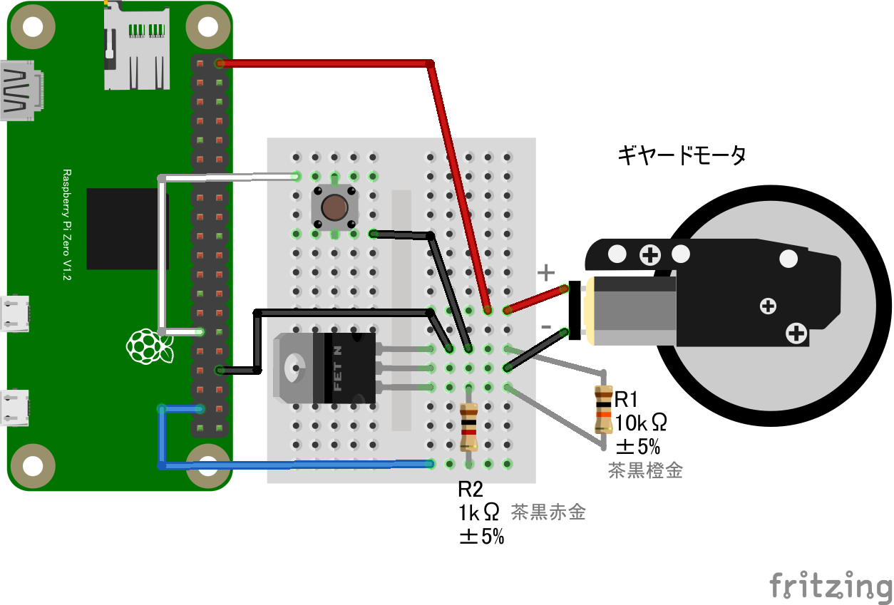

### GPIO スイッチとギヤードモーター

#### 概要

* スイッチを押すとモーターが回転し、離すと停止
* 前項 LED 制御と同様の構成

#### 配線図

{width=353px height=226px}

GPIO ポート 5 にスイッチ、GPIO ポート 26 にモーター制御回路を繋ぎます。

#### CHIRIMEN 用ドライバのインストール

- 不要

#### サンプルコード (main.js)

```javascript
import {requestGPIOAccess} from "./node_modules/node-web-gpio/dist/index.js";
const sleep = msec => new Promise(resolve => setTimeout(resolve, msec));
let port2;

async function startGpio() {
  const gpioAccess = await requestGPIOAccess();
  
  port2 = gpioAccess.ports.get(26);
  await port2.export("out");

  const port = gpioAccess.ports.get(5);
  await port.export("in");
  port.onchange = showPort;
}

function showPort(ev){
	console.log(ev.value);
    if (ev.value==0){
        port2.write(1);
    } else {
        port2.write(0);
    }
}

startGpio();
```
