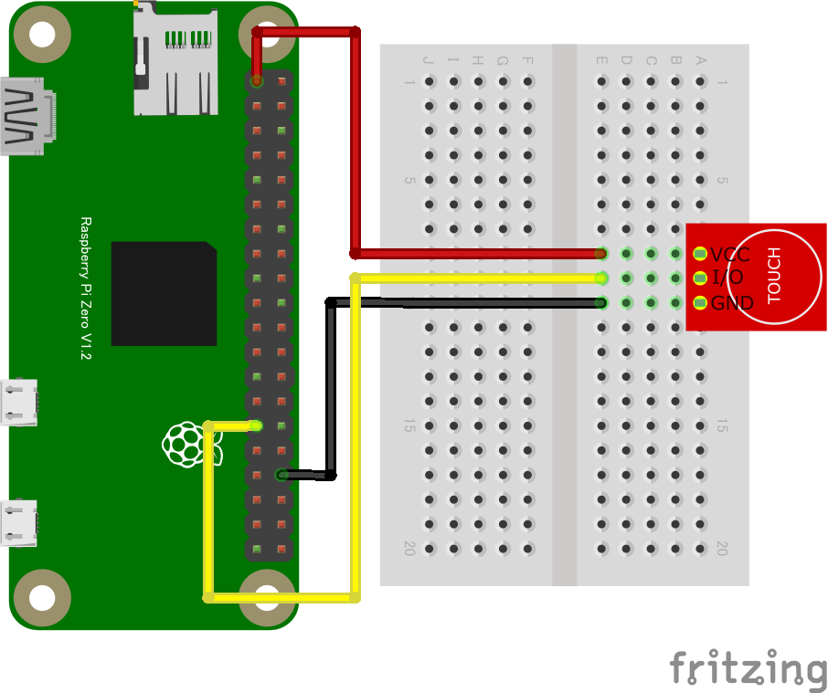

## タッチセンサー

### GPIOタッチセンサー

#### 概要

* タッチや金属の近接で反応する静電容量式センサーの状態を検知
* 指でのタッチだけでなく金属の近接も感知(1~2mm の接近で検知)

#### 配線図

{width=258px height=194px}

#### CHIRIMEN 用ドライバのインストール

- 不要

#### サンプルコード (main.js)

```javascript
import {requestGPIOAccess} from "./node_modules/node-web-gpio/dist/index.js";
const sleep = msec => new Promise(resolve => setTimeout(resolve, msec));

async function switchCheck() {
  const gpioAccess = await requestGPIOAccess();
  const port = gpioAccess.ports.get(5);

  await port.export("in");
  port.onchange = showPort;

}

function showPort(ev){
	console.log(ev.value);
}

switchCheck();
```

#### 特記事項

* GPIO ポート 5 に接続、3.3 V 電源を使用
* 金属がセンサーのピンに触れてショートしないよう、テープで被覆して絶縁して下さい
