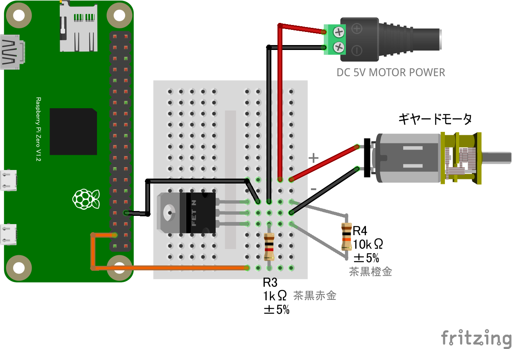

### ギヤードモーター part2

#### 概要

* ギヤードモーター (GPIO OUTPUT)外部電源を使用する場合
* ギヤードモーターの回転・停止

#### 配線図　

{width=85% height=85%}

5V 以外の DC 電源も使用可能

#### CHIRIMEN 用ドライバのインストール

- 不要

#### サンプルコード (main.js)

- ギヤードモーター part1 と同じコードです。
