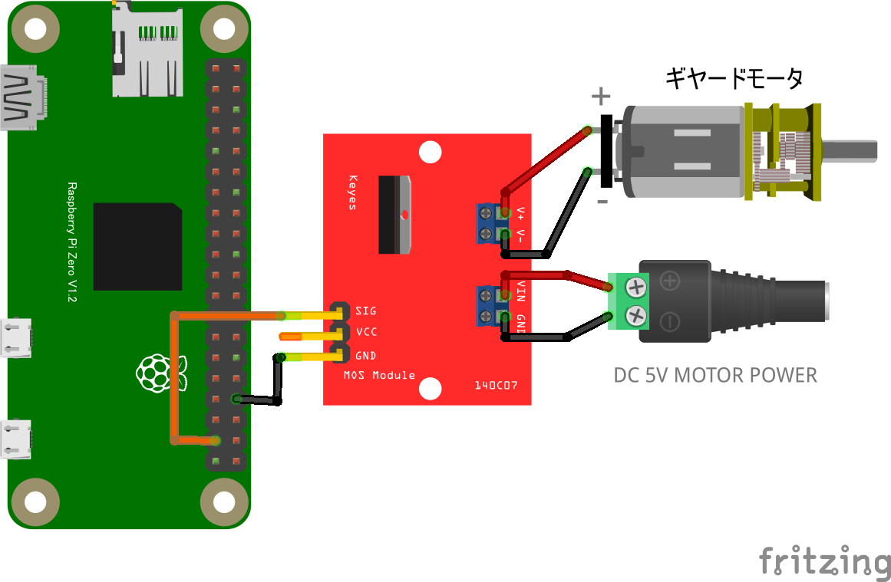

### MOSFET P718Dモジュール

#### 概要

* MOSFET モジュール基板を使用する場合 P718D モジュール

#### 配線図


#### CHIRIMEN 用ドライバのインストール

- 不要

#### サンプルコード (main.js)

```javascript
import {requestGPIOAccess} from "./node_modules/node-web-gpio/dist/index.js";
const sleep = msec => new Promise(resolve => setTimeout(resolve, msec));

async function blink() {
  const gpioAccess = await requestGPIOAccess();
  const port = gpioAccess.ports.get(26);

  await port.export("out");

  for (;;) {
    await port.write(1);
    await sleep(1000);
    await port.write(0);
    await sleep(1000);
  }
}

blink();
```
