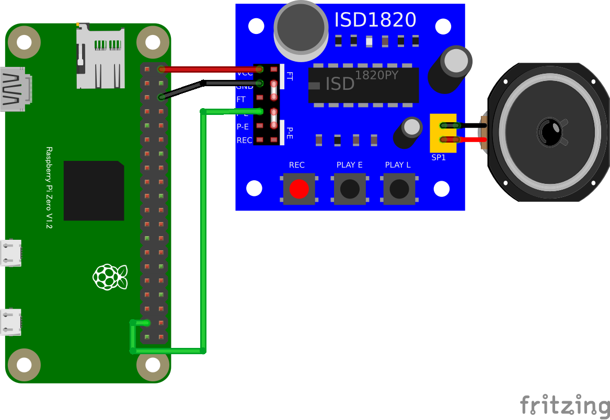

## 音声録音

### ISD1820ボイスレコーダ (GPIO OUTPUT)

#### 概要

* 音声の録音と再生を簡単に行えるモジュール

#### 配線図

{width=343px height=236px}

#### CHIRIMEN 用ドライバのインストール

- 不要

#### サンプルコード (main.js)

```javascript
import {requestGPIOAccess} from "./node_modules/node-web-gpio/dist/index.js";
const sleep = msec => new Promise(resolve => setTimeout(resolve, msec));

async function blink() {
  const gpioAccess = await requestGPIOAccess();
  const port = gpioAccess.ports.get(26);

  await port.export("out");

  for (;;) {
    await port.write(1);
    await sleep(3000); // 3秒間再生
    await port.write(0);
    await sleep(1000); // 1秒間停止
  }
}

blink();
```

#### 特記事項

* GPIO ポート26を ISD1820 の P-L 端子に接続します。(P-L 端子が High になっている間だけ再生します(PLAY L ボタンと同じ動作))
* P-E 端子に繋いだ場合、録音した内容を全部再生するようになります。(PLAY E ボタンと同じ動作)
* 録音は REC ボタンを押している間録音できます(最大 10 秒)
* REC 端子を GPIO に接続すると、録音をコンピュータで制御することもできます。(REC 端子が High になっている間だけ録音)
