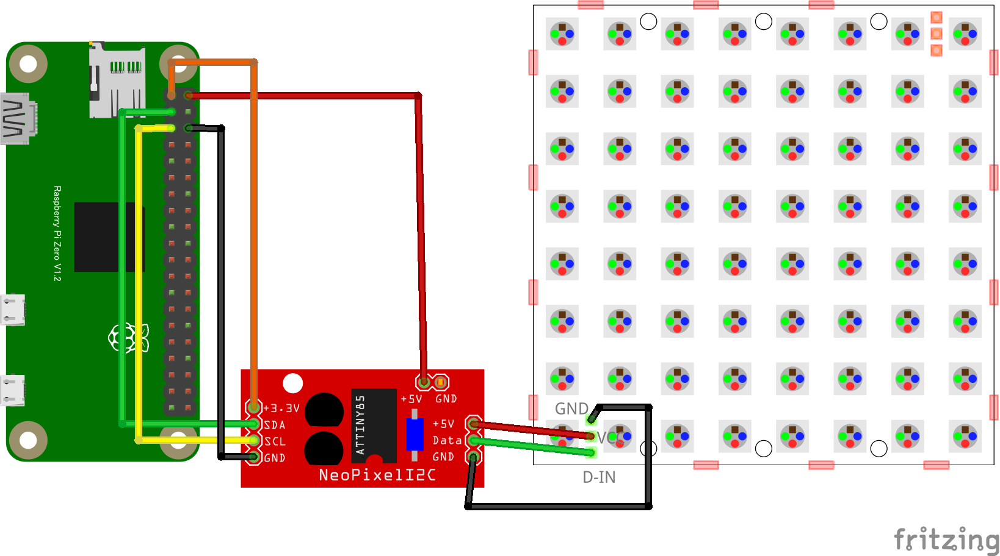

# Neopixel LED

## 配線図


## 配線図（専用ボード使用）



## サンプルコード (main.js)

```javascript
import { requestI2CAccess } from "./node_modules/node-web-i2c/index.js";
import NPIX from "@chirimen/neopixel-i2c";
const sleep = msec => new Promise(resolve => setTimeout(resolve, msec));

const neoPixels = 7; // LED個数

main();

async function main() {
    const i2cAccess = await requestI2CAccess();
    const port = i2cAccess.ports.get(1);
    const npix = new NPIX(port, 0x41);
    await npix.init(neoPixels);

    await nPixTest1(npix);

    await nPixTest2(npix);

    await nPixTest3(npix, pattern4);

    await npix.setGlobal(0, 0, 0);
}

async function nPixTest1(npix) {
    // 全LEDを同じ色にするケース
    await npix.setGlobal(10, 0, 0);
    await sleep(200);
    await npix.setGlobal(0, 10, 0);
    await sleep(200);
    await npix.setGlobal(0, 0, 10);
    await sleep(200);
    await npix.setGlobal(0, 20, 20);
    await sleep(200);
    await npix.setGlobal(20, 0, 20);
    await sleep(200);
    await npix.setGlobal(20, 20, 0);
    await sleep(200);
    await npix.setGlobal(20, 20, 20);
    await sleep(200);
    await npix.setGlobal(0, 0, 0);
}

// パターンはRRGGBB の並びで
const pattern0 = [0xff0000, 0x00ff00, 0x0000ff, 0xff0000, 0x00ff00, 0x0000ff, 0xff0000];
const pattern1 = [0x000000, 0x00ff00, 0x0000ff, 0xff0000, 0x00ff00, 0x0000ff, 0xff0000];
const pattern2 = [0x000000, 0x000000, 0x0000ff, 0xff0000, 0x00ff00, 0x0000ff, 0xff0000];
const pattern3 = [0x000000, 0x000000, 0x000000, 0xff0000, 0x00ff00, 0x0000ff, 0xff0000];
const pattern4 = [0x000000, 0x000000, 0x000000, 0x000000, 0x00ff00, 0x0000ff, 0xff0000];
const pattern5 = [0x000000, 0x000000, 0x000000, 0x000000, 0x000000, 0x0000ff, 0xff0000];
const pattern6 = [0x000000, 0x000000, 0x000000, 0x000000, 0x000000, 0x000000, 0xff0000];
const pattern7 = [0x000000, 0x000000, 0x000000, 0x000000, 0x000000, 0x000000, 0x000000];

async function setPattern(npix, pattern) {
    // パターン設定
    const grbArray = [];
    for (const color of pattern) {
        const r = color >> 16 & 0xff;
        const g = color >> 8 & 0xff;
        const b = color & 0xff;
        grbArray.push(g);
        grbArray.push(r);
        grbArray.push(b);
    }
    await npix.setPixels(grbArray);
}

async function nPixTest2(npix) {
    // パターンを変化させる
    await setPattern(npix, pattern0);
    await sleep(200);
    await setPattern(npix, pattern1);
    await sleep(200);
    await setPattern(npix, pattern2);
    await sleep(200);
    await setPattern(npix, pattern3);
    await sleep(200);
    await setPattern(npix, pattern4);
    await sleep(200);
    await setPattern(npix, pattern5);
    await sleep(200);
    await setPattern(npix, pattern6);
    await sleep(200);
    await setPattern(npix, pattern7);
}

async function nPixTest3(npix, pattern) {
    // パターンを流す
    for (let i = 0; i < 30; i++) {
        const p = i % pattern.length;
        const spattern = [];
        for (let px = 0; px < pattern.length; px++) {
            const pp = (i + px) % pattern.length;
            spattern.push(pattern[pp]);
        }
        console.log(spattern);
        await setPattern(npix, spattern);
        await sleep(200);
    }

}
```


---
[← 目次に戻る](../index.md)
