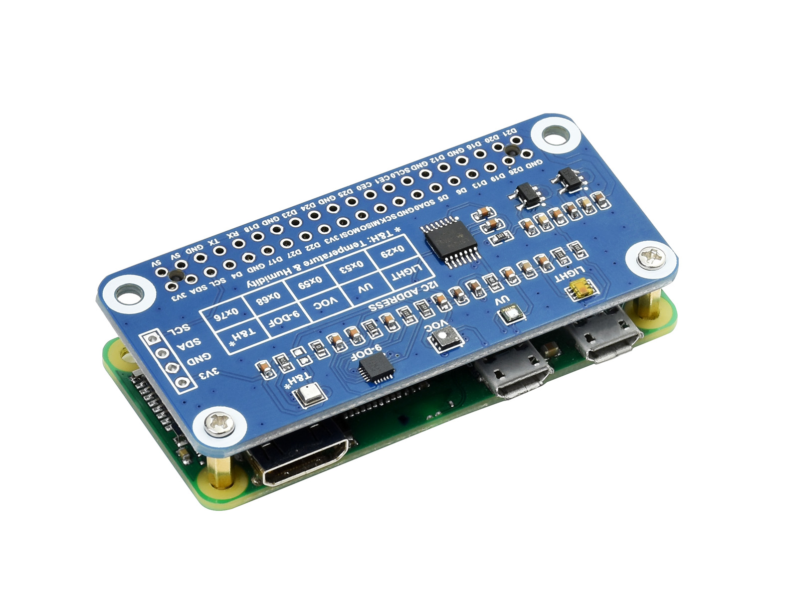

# WAVESHARE20471複合センサーボード

## 配線図

[説明ページの組み立て方](https://www.waveshare.com/wiki/Environment_Sensor_HAT#Hardware_connection)に従ってRaspberry Pi Zeroに接続したら完了です。




## サンプルコード (main.js)

```javascript
// webI2C
import { requestI2CAccess } from "./node_modules/node-web-i2c/index.js";

// I2c device drivers
import BME280 from "@chirimen/bme280"; // BME280
import ICM20948 from "@chirimen/icm20948"; // ICM20948
import LTR390 from "@chirimen/ltr390"; // LTR390
import TSL2591 from "@chirimen/tsl2591"; // TSL2591
import SGP40 from "@chirimen/sgp40"; // SGP40

const sleep = (msec) => new Promise((resolve) => setTimeout(resolve, msec));

var sgp40, tsl2591, ltr390, icm20948, bme280;

main();

async function main() {
	// initialize I2C
	const i2cAccess = await requestI2CAccess();
	const ic2Port = i2cAccess.ports.get(1);
	// initialize I2C devices
	
	sgp40 = new SGP40(ic2Port);
	tsl2591 = new TSL2591(ic2Port);
	ltr390 = new LTR390(ic2Port);
	icm20948 = new ICM20948(ic2Port);
	bme280 = new BME280(ic2Port, 0x76); // これだけ0x76忘れずに

	await sgp40.init();
	await tsl2591.init();
	await ltr390.init();
	await icm20948.init();
	await bme280.init();

	// sensing loop
	while (true) {
		const sgp = await sgp40.measureRaw(25, 50);
		const tsl = await tsl2591.Lux();
		const ltr = await ltr390.UVS();
		const icm = await icm20948.getdata();
		const bme = await bme280.readData();
		
		console.log("=======================================================");
		console.log("Pressure: ",bme.pressure);
		console.log("Temperature: ",bme.temperature);
		console.log("Humidity: ",bme.humidity);
		console.log("Lux: ",tsl);
		console.log("UV: ",ltr);
		console.log("Gas: ", sgp );
		console.log(`Roll = ${icm[0].toFixed(2)} , Pitch = ${icm[1].toFixed(2)} , Yaw = ${icm[2].toFixed(2)}`);
		console.log(`Acceleration: X = ${icm[3]}, Y = ${icm[4]}, Z = ${icm[5]}`);
		console.log(`Gyroscope:     X = ${icm[6]} , Y = ${icm[7]} , Z = ${icm[8]}`);
		console.log(`Magnetic:      X = ${icm[9]} , Y = ${icm[10]} , Z = ${icm[11]}`);
		
		await sleep(1000);
	}
}
```


---
[← 目次に戻る](../index.md)
