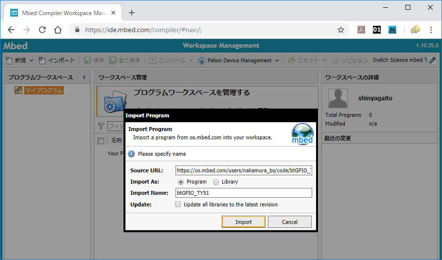

# TY51822r3 のファームウェアをビルドする

CHIRIMEN for TY51822r3 を利用するには使用する BLE ボード TY51822r3 に専用のファームウェアを書き込む必要があります。

TY51822r3 は MBED をサポートしており、PC と USB で接続するとドライブとして認識されます。単にビルド済みのバイナリを書き込むだけであれば、PC と接続した時に認識されたドライブにバイナリファイル (.hex) をコピーするだけで書き込み操作が行われます。

このページでは MBED 環境を使ってファームウェアを自分でビルドする場合の手順を説明します。

## 1. アカウントの作成

MBED はブラウザ上で使用できるオンラインの開発環境です。MBED を使用するには MBED のアカウントが必要になります。PC と接続して認識されたドライブ上に HTML ファイルがありますので、これをブラウザで開くと MBED のページに飛ぶ事ができます。


もしまだ MBED のアカウントをお持ちでないならば Sign up を選択してアカウントを登録してください。アカウントにログインした状態で TY51822r3 のドライブ内のリンクからアクセスするとプラットフォームとして TY51822r3 が追加されます。

## 2. プログラムのインポート

CHIRIMEN for TY51822r3 のファームウェアは下のリンクで公開されています。

[btGPIO_TY51](https://os.mbed.com/users/nakamura_bs/code/btGPIO_TY51/)

MBED のアカウントにログインして、このページの右側にある「Import into Compiler」の黄色いボタンを押すと自分のワークスペースにインポートする事ができます。



## 4. プログラムをビルドする

画面上部にある「コンパイル」のボタンを押すとコンパイルが開始され、バイナリファイル ```(btGPIO_TY51.TY51822R3.hex)``` が作成されますので適当な場所に保存してください。このファイルを TY51822r3 のドライブにコピー操作をする事でターゲットへの書き込みが行われます。


