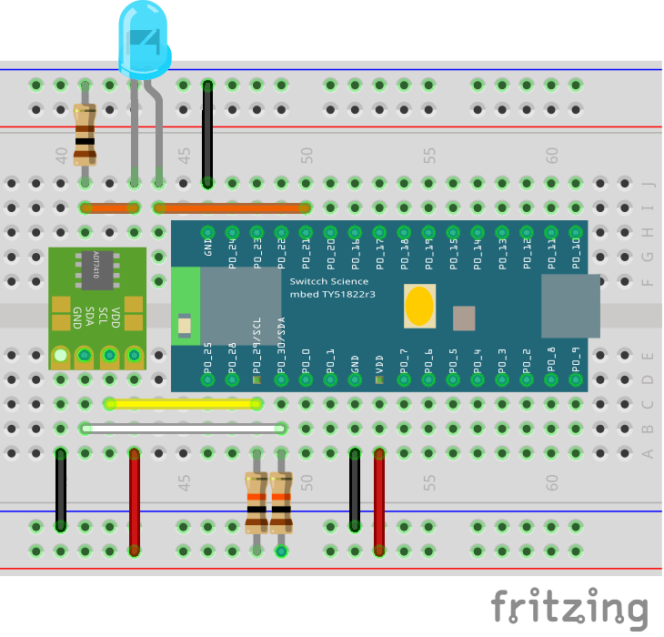

# Hello Real World

CHIRIMEN for TY51822r3 を使用して L チカと I2C 温度計で気温を計測を行います。

# 1. L チカをやってみよう

## 用意するもの
| CHIRIMEN for TY51822r3 基本ハードウェア | L チカに使用する部品| I2C 温度計で使用する部品|
|---|---|---|
||||

- PC(Win または Mac) BLE に対応していること
- 書き込み済みのBLE開発ボード[スイッチサイエンス TY51822r3](https://www.switch-science.com/catalog/2574/?gclid=CjwKCAiA9efgBRAYEiwAUT-jtO3rkZ_sHHdPO15clRze6Sp-oG1NNPB7Kj2A36Hv1ddqWbHO6YHXYxoCOcQQAvD_BwE)
- USB micro B ケール
- 青色 LED
- [ピンヘッダー 16 Pin](http://akizukidenshi.com/catalog/g/gC-00167/) × 2
- ブレッドボード
- ジャンパー線 × 適宜
- 赤色 LED × 1
- [ADT7410使用 I2C 温度センサーモジュール](http://akizukidenshi.com/catalog/g/gM-06675/)
- 抵抗 330Ω
- 抵抗 100Ω
- 抵抗 10kΩ × 2

注意 
ピンヘッダは、目的のピン数に折って使用してください。 
[TY51822r3 の書き込み方や、事前準備はこちらを参照してください。](setting.md)

## 配線

  
  
右図と同じように配線してみてください。 
[実際に配線した図はこちら](imgs/section0/ledblink_breadboard.jpeg) 
[回路図はこちら](imgs/section0/ledblink_schematic.png) 
注意 
LED には極性 (方向) があり、足が長い方 (アノード) を GPIO 出力ピンに、足が短い方 (カソード) を GND 側に繋いでください。抵抗は LED のどちらの足の側に繋いでも構いません。
 
[詳しくはこちらをご覧ください: LED の使い方](https://www.marutsu.co.jp/pc/static/large_order/led)

## Example を実行しよう

  
 
初めに [LIVE example](https://chirimen.org/chirimen-TY51822r3/bc/gpio/LEDblink/) を開いてください。 
ブラウザには右図のような画面が表示されているはずです。
BLE 接続をクリックすると、右図のようになります。

Y51822r3 がちゃんと動作していれば、リストに「btGPIO2」 という名前のデバイスが見つかるはずです。 
これが CHIRIMEN for TY51822r3 用のデバイスになります。 
それを選択して「ペア設定」のボタンを押すとダイアログと青いバーが消え、接続が確立します。
 
 

ブレッドボード上では LED が点滅して L チカが動作しはじめます。

[L チカ成功動画はこちら](imgs/section0/ledblink.jpg)

[今回使用したコードはこちら](https://github.com/chirimen-oh/chirimen-TY51822r3/tree/master/bc/gpio/LEDblink)

* [その他の GPIO の例はこちら](https://chirimen.org/chirimen-TY51822r3/bc/)
* [L チカについてもっと詳しく知りたい方はこちらを参照してください。](section0.md)

L チカ編はこれで終了です

# 2. I2C 温度センサー使ってみよう

    
  
## 配線

右図と同じように配線してみよう。 
[回路図はこちら](imgs/section2/adt7410_schematic.png) 

  
## Example を実行しよう

初めにこちらの [LIVE example](https://chirimen.org/chirimen-TY51822r3/bc/i2c/i2c-ADT7410/) を開いてください。 
BLE 接続をクリックすると、右図のようになります。

  
ターゲットの gtGPIO2 を選択して「ペア設定」を押してください。
  
BLE の接続が正常にできれば、青いバーが消え動作を開始します。
  
右下の図に数字がでていますね。

これが温度センサーから取得した現在の温度 (摂氏) の表示になります。

これで I2C 温度計は完了です。

[今回使用したコードはこちら](https://github.com/chirimen-oh/chirimen-TY51822r3/tree/master/bc/i2c/i2c-ADT7410)

* [その他の I2C の例はこちら](https://chirimen.org/chirimen-TY51822r3/bc/)

I2C 温度計編はこれで終了です

