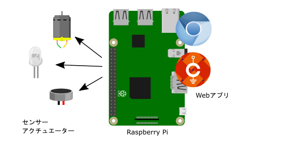
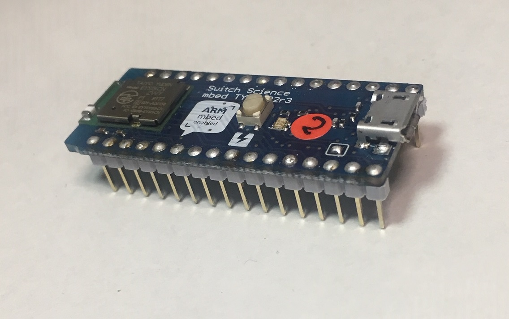
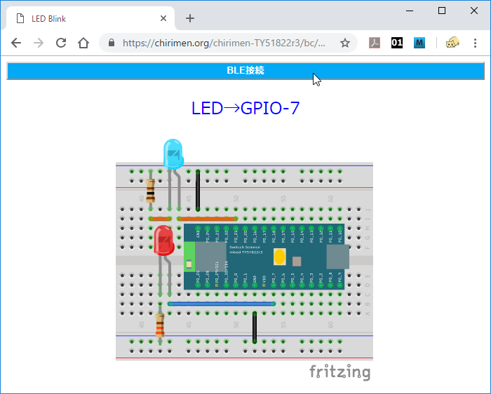
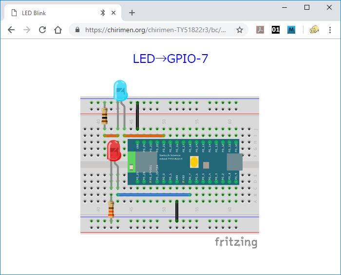

# 0. Hello World 編

# 1. 今回のゴール

CHIRIMEN for TY51822r3 の使い方をおぼえて、Webアプリから「Lチカ」（LEDをつけたりけしたり）するプログラミングをやってみよう。

1. 今回のゴール
2. 事前準備
3. Lチカをやってみよう
4. コードを眺めてみよう

## CHIRIMEN for TY51822r3 とは
まず CHIRIMEN for TY51822r3 の基礎となっている CHIRIMEN とは [Web GPIO](http://browserobo.github.io/WebGPIO/) や、[Web I2C](http://browserobo.github.io/WebI2C/) といった JavaScript の API を使用してセンサーやアクチュエーターなどの物理デバイスを Web 技術だけで制御する事ができる IoT 環境です。

実際に利用できる環境として、現在 Raspberry Pi 3 上で動作する「CHIRIMEN for Raspberry Pi 3 が CHIRIMEN コミュニティにより公開されています。

CHIRIMEN for Raspberry Pi 3 についての詳しい情報は以下のリンクを参照してください。  
[CHIRIMEN 公式ページ](https://chirimen.org/)  
[CHIRIMEN チュートリアル](https://tutorial.chirimen.org)  

CHIRIMEN for Raspberry Pi 3 の構成  


CHIRIMEN for TY51822r3 はこれを発展させて、PC 等のブラウザと Bluetooth LE (BLE) でワイヤレス接続された IO BLE インターフェースボードとセンサーやアクチュエーターの組み合わせで動作可能にした IoT 環境になります。BLE のインターフェースボードとしてはスイッチサイエンス社の BLE 開発ボード TY51822r3 を使用します。

CHIRIMEN for Raspberry Pi 3 では ラズベリーパイに接続されたセンサー等をラズベリーパイ自身の上で動作する Web アプリで制御するのに対し、CHIRIMEN for TY51822r3 では、BLE ボードに接続されたセンサー等をワイヤレス接続した PC 等の上で動作する Web アプリで制御します。

CHIRIMEN for TY51822r3 の構成  


上の図では、Web アプリを動かす側が PC となっていますが Chrome または Chromium ブラウザであれば動作しますので、Raspberry Pi と BLE ボードの組み合わせでセンサーと本体が分離した組み込み型の機器などを作る事も可能です。

もし CHIRIMEN for Raspberry Pi 3 について既に知識があり、CHIRIMEN for TY51822r3 での相違点を知りたい場合は、
[CHIRIMEN for TY51822r3 と CHIRIMEN for Raspberry Pi 3 の違い](diff.md) のページをご覧ください。

# 2. 事前準備 (機材確認)

## 用意するもの

### 基本ハードウエア
下記が CHIRIMEN for TY51822r3 を使ってブレッドボード上でセンサー等を動かす際に最低限必要となる基本ハードウエアです。


* BLE 開発ボード [スイッチサイエンス TY51822r3](https://www.switch-science.com/catalog/2574/?gclid=CjwKCAiA9efgBRAYEiwAUT-jtO3rkZ_sHHdPO15clRze6Sp-oG1NNPB7Kj2A36Hv1ddqWbHO6YHXYxoCOcQQAvD_BwE) × 1
* PC (Windows または Mac、BLE に対応している事) × 1
* BLE 開発ボードに電源を供給するための USB Micro B ケーブル x 1
* ピンヘッダー 16 Pin x 2
* ブレッドボード x 1、ジャンパー線 x 適宜
* 青色 LED x 1、抵抗 100Ω x 1

TY51822r3 側のコネクタは USB Micro B ですので、PC 側のコネクタが USB-C 等の場合は適宜アダプタ等を使用してください。また、TY51822r3 と PC のデータ的な接続は BLE で行いますので、TY51822r3 への給電は PC からではなく、別途用意された AC アダプタ等からでも構いません。ただし購入後の一番最初は PC と接続して TY51822r3 にプログラムを書き込む必要があります。

ピンヘッダーは TY51822r3 をブレッドボード上で使用するために別途用意する必要があります。

LED と抵抗はこのチュートリアルの全ての example で BLE の接続状態を表示するために共通して使用します。LED は色によって動作する電圧に差がありますので、もし違う色を使用する際は抵抗の値を調整する必要があります。

### L チカに必要となるパーツ
このチュートリアルでは CHIRIMEN for TY51822r3 を動作させる最も簡単なテストである「Lチカ (えるちか)」を行います。L チカを行うために下記パーツが必要になります。


* 赤色 LED × 1
* 抵抗 330Ω × 1

この赤色 LED が L チカの動作のターゲットです。基本ハードウェアに入っている青色 LED の方は BLE の接続状態の表示のために使用します。

## TY51822r3 にピンヘッダーを半田付けする

TY51822r3 はピンヘッダーが無い状態で販売されています。ブレッドボードで使用するにはまず、別途用意したピンヘッダー (16 Pin x 2) を端子に半田付けしておく必要があります。ピンヘッダーを半田付けしたものが下の写真です。



## TY51822r3 に CHIRIMEN for TY51822r3 のファームウェアを書き込む

TY51822r3 には MBED で CHIRIMEN for TY51822r3 用のファームウェア (btGPIO_TY51_xxxxxxxx.hex) を書き込んでおく必要があります。

### (1) ファームウェアのダウンロード
ビルド済みのバイナリファイルが準備されていますので下のリンクからダウンロードしてください。

**[btGPIO_TY51_20181220.hex](https://chirimen.org/chirimen-TY51822r3/bc/ble_fw/btGPIO_TY51_20181220.hex)**  

ブラウザでリンクを開くとダウンロードが開始されます。

### (2) TYBLE51822r3 ボードの USB コネクタと PC/Mac をケーブルで接続

接続すると PC/Macに MBED ドライブとして認識されます。もし認識されない場合はケーブルがデータ通信対応であることを確認してください

### (3) ファームウェアのコピー

MBED ドライブに (1) のファイルをコピーもしくはドラッグアンドドロップしてください。コピー中は TYBLE51822r3 ボード上の赤色 LED が点滅します。

コピーが終わると自動的に .hex ファイルを認識してファームの書き換えと再起動が行われ、コピーした .hex ファイルが削除されてから再度 MBED ドライブが認識されます。

もし MBED ドライブ内に FAIL.TXT があった場合はファイルの書き込みに失敗しています。ケーブルを繋ぎ直して再度実行してみてください。Mac で失敗することが多い場合は `cp -X` コマンドでファイルコピーをすると失敗しなくなる場合もあるようです。

TY51822r3 用のファームウェアを自分でビルドしてみたい場合は MBED のオンラインコンパイラを使用します。この手順については [TY51822r3 のファームウェアをビルドする](bridge.md) を参照してください。

## ブラウザの確認

CHIRIMEN for TY51822r3 は WebBluetooth という新しい機能を使用しますので、ブラウザとして Chrome (Chromium) の最新版が必要です。
Chrome のバージョンを確認して必要ならアップデートしておいてください。

アドレスバーに `chrome://settings/help` と入力すれば最新版かどうかの確認とアップデートができます。


### Windows の場合

Windows の場合は WebBluetooth 機能がまだ実験的機能扱いのため、現在のところ次の設定も必要です。  
(2018年12月30日現在、リリースされている Windows 版 Chrome 71.0.3578.98 ではこの操作が必要ですが、今後の Chrome のアップデートで不要になります)

ブラウザのアドレスバーに `chrome://flags` と入力します。


各種フラグの一覧が表示されますので `Experimental Web Platform features` という項目を探します (`Search flags` のフィールドに `Experimental Web Platform` と入力すれば絞り込んでくれます)。

`Experimental Web Platform features` の設定がデフォルトでは `Disabled` になっているはずですのでこれを `Enabled` に設定します。その後 Chrome の再起動が要求されますので再起動してください。


## CHIRIMEN for TY51822r3 LIVE examples へのアクセス

CHIRIMEN for TY51822r3 のアプリはブラウザ上で動作する Web アプリですのでブラウザでアクセスするだけで動作します。

各種の example が次の URL で公開されていますので Chrome ブラウザでアクセスしてみてください。

[**https://chirimen.org/chirimen-TY51822r3/bc/**](https://chirimen.org/chirimen-TY51822r3/bc/)


なお、CHIRIMEN for TY51822r3 の本体は GitHub で公開されています。  
[https://github.com/chirimen-oh/chirimen-TY51822r3](https://github.com/chirimen-oh/chirimen-TY51822r3)  
ここから全体をダウンロードしてローカルに動作環境を構築する事もできます。

今回は、LIVE examples の中から、「**GPIO examples**」の「[**LEDblink**](https://chirimen.org/chirimen-TY51822r3/bc/gpio/LEDblink/)」のリンクをクリックしてください。

次のような画面が開きます。まだ動作を開始していませんが、これが「L チカ」のアプリになっており、また動作に必要なブレッドボード上の配線が図示されています。

[](https://chirimen.org/chirimen-TY51822r3/bc/gpio/LEDblink/schematic.png)

# 3. 「L チカ」をやってみよう
無事、TY51822r3 と PC の準備が整ったら、いよいよ L チカに挑戦してみましょう。

## 「L チカ」とは？
新しいプログラム言語を学ぶ際に、一番最初に画面に「hello world.」と表示するだけのプログラムを書いた経験のある人は多いと思います。
「L チカ」はマイコンでハードウェア制御をする時の第一歩、「hello world.」に相当するもので、LED を点けたり消したりすることで、チカチカさせることです。今回は「LEDを点ける」「LEDを消す」をプログラムで繰り返し実行することで実現します。これによって PC 上で動いている JavaScript のプログラムから BLE 経由で TY51822r3 に接続された周辺機器を動かすという基本動作を確認できます。

* 参考：[LED（発光ダイオード）](https://ja.wikipedia.org/wiki/%E7%99%BA%E5%85%89%E3%83%80%E3%82%A4%E3%82%AA%E3%83%BC%E3%83%89)

## 配線してみよう

さっき開いた LIVE examples の LEDblink の画面を見て、その通りにブレッドボード上の配線を行ってください。ややこしく見えるかも知れませんが、回路としては LED1 端子と GND 間、PO_7 端子と GND 間にそれぞれ LED と抵抗を繋いでいるだけです。


LED は2本のリード線が出ていますが向きがあり、長い方がアノード（+側）、短い側がカソード（-側）です。LED のリード線の方向に注意しながら、図の通りにジャンパー線やブレッドボードを使って配線してみましょう。配線図では LED の下側のリード線が折れ曲がり長い方がアノード (+側)です。

長すぎる部品のリード線を切る場合も元の長さの違いがわかるように切るのがおすすめです。もし向きがわからなくなってしまった場合は、少し見づらいですが一般的な形状の LED なら内部の電極の形が小さい方がアノード (+側) と判断する事もできます。

どうしても向きがわからなくなった場合はテスター等で確かめる必要があります。

LED が 2 個使われていますが、赤い LED の方が今回の example で点滅させるターゲットの LED になります。
青い LED は TY51822r3 の BLE の接続状態を表示するためのものです。以降の example でも青い LED の部分は同様に出てきますが、無くても example の動作自体は可能です。

実際に配線してみると、こんな感じになりました。


### 注記

LED は必要な電圧やどれくらいの明るさで光るかについて型番による差が大きい部品です。このサンプルでは 3.3V の出力に対して LED に接続する抵抗は 赤色 LED では 330Ω、青色 LED では 100Ω としていますが、必要ならば部品によって適切に調整してください。特に、青色や白色の LED は必要な電圧が高いため、LED によっては 3.3V で光らせるのが難しい場合もあります。

### 参考
* [ブレッドボードの使い方](https://www.sunhayato.co.jp/blog/2015/03/04/7)
* [LEDの使い方](https://www.marutsu.co.jp/pc/static/large_order/led)
* [抵抗値の読み方](http://www.jarl.org/Japanese/7_Technical/lib1/teikou.htm)
* [テスターを使って抵抗値を確かめる](http://startelc.com/elcLink/tester/elc_nArtcTester2.html#chapter-2)

## example を実行してみる
配線がうまくできたら、さっそく動かしてみましょう。
Chrome または Chromium ブラウザで LIVE examples の LEDblink のページは開いているでしょうか?

[**https://chirimen.org/chirimen-TY51822r3/bc/gpio/LEDblink/**](https://chirimen.org/chirimen-TY51822r3/bc/gpio/LEDblink/)

ブラウザには次のような画面が表示されているはずです。



この状態ではまだ BLE の接続がされていません。  
次にブラウザ画面の上部にある「BLE 接続」の青いバー型のボタンをクリックします。  
すると次のようなダイアログが表示されて Bluetooth のスキャンが行われます。


TY51822r3 がちゃんと動作していれば、リストに「btGPIO2」 という名前のデバイスが見つかるはずです。これが CHIRIMEN for TY51822r3 用のデバイスになります。  
それを選択して「ペア設定」のボタンを押すとダイアログと青いバーが消え、接続が確立します。  

ブレッドボード上ではの赤色 LED が点滅して L チカが動作しはじめます。



なおこの時、青い LED も点灯しますが、こちらは BLE の接続が確立されている事を表しています。

* 消灯 : 未接続
* 点灯 : 接続中
* 点滅 : 通信中 (BLE モジュール動作中)  

となりますので、赤の LED の状態が切り替わるタイミングで一瞬消灯するのがわかるかと思います。  

## Lチカの様子

L チカに成功しましたか？！  
次の動画は動作中のブレッドボードの様子です。

[](imgs/section0/ledblink.mp4)

## うまくいかなかったら?
* 複数のブラウザやタブ等から同じデバイスに接続しようとした場合などは正常に動作しません。
  * まず他のブラウザやタブを閉じてから試してください。
  * TY51822r3 の基板にある黄色いリセットボタンを押してから再度試してみてください。

* BLE の接続で対応デバイスが見つからない場合
  * TY51822r3 が正常に動作していない可能性があります。USB コネクタからの電源の供給、MBED でのプログラムの書き込みが正常に行われたか等を確認してください。

* BLE の接続はされるが LED が点滅しない場合
  * ブレッドボード上の配線を確認してください。

* 青色 LED が点灯しない場合
  * 青色 LED の種類によっては TY51822r3 の出力 3.3V で点灯させるのが困難な事があります。L チカ自体はできているが青色 LED だけが点灯しない場合は他の種類の 青色 LED に変更してみるか、赤色 LED と 330Ω の組み合わせに替えてみてください。

# 4. コードを眺めてみよう

example のコードは GitHub のリポジトリページで見る事ができます。
L チカのコードは以下のページをみてください。

[GitHub : chirimen-TY51822r3/bc/gpio/LEDblink/](https://github.com/chirimen-oh/chirimen-TY51822r3/tree/master/bc/gpio/LEDblink)

## HTML

```html
<!doctype html>
<html>
  <head>
    <meta charset="UTF-8" />
    <title>LED Blink</title>
    <script src="../../polyfill/blePolyfill.js"></script>
    <script src="./main.js"></script>
  </head>
  <body>
  <div><input type="button" id="BLECONN" value="BLE接続"></div>
  </body>
</html>
```

見やすくするためにスタイル関係等を除いて重要な部分だけを抜き出していますが、HTML では最初に `blePolyfill.js` という JavaScript ライブラリを読み込んでいます。  

CHIRIMEN for Raspberry Pi 3 を触った事がある方ならわかると思いますが、CHIRIMEN for Raspberry Pi 3 では `polyfill.js` という名前のライブラリによって [Web GPIO API](http://browserobo.github.io/WebGPIO/) と、[Web I2C API](http://browserobo.github.io/WebI2C/) がサポートされていましたが CHIRIMEN for TY51822r3 ではこれが `blePolyfill.js` に変わっています。

この [Polyfill (ブラウザ標準に未実装の機能などを利用可能にするためのライブラリ)](https://developer.mozilla.org/ja/docs/Glossary/Polyfill) を最初に読む込むことで GPIO や I2C の API が使えるようになります。

また、HTML には BLE を接続するためのボタンが準備されています。CHIRIMEN for TY51822r3 では WebBluetooth による BLE 接続を使用しますが、セキュリティ上の制限によりユーザーがボタンを押すなどのアクションをトリガーとして接続を開始しなくてはなりません。つまり、アプリを起動するだけで勝手にデバイスに接続して動き始めるような使い方はできません。

## JavaScript

```javascript
'use strict';

const DEVICE_UUID     = "928a3d40-e8bf-4b2b-b443-66d2569aed50";
let connectButton;
window.addEventListener(
  "load",
  function() {
    connectButton = document.querySelector("#BLECONN");
    connectButton.addEventListener("click", mainFunction);
  },
  false
);

async function mainFunction(){ // プログラムの本体となる関数、非同期処理のためプログラム全体をasync関数で包みます。
	var bleDevice = await navigator.bluetooth.requestDevice({
      filters: [{ services: [DEVICE_UUID] }] });
	var gpioAccess = await navigator.requestGPIOAccess(bleDevice); // thenの前の関数をawait接頭辞をつけて呼び出します。
	connectButton.hidden = true;
	var port = gpioAccess.ports.get(7);
	await port.export("out");
	var v = 0;
	while ( true ){ // 無限ループ
		await sleep(1000); // 1000ms待機する
		v ^= 1; // v = v ^ 1 (XOR 演算)の意。　vが1の場合はvが0に、0の場合は1に変化する。1でLED点灯、0で消灯するので、1秒間隔でLEDがON OFFする。
		await port.write(v);
	}
}

// この関数の定義方法はとりあえず気にしなくて良いです。コピペしてください。
// 単に指定したms秒スリープするだけの非同期処理関数
function sleep(ms){
	return new Promise( function(resolve) {
		setTimeout(resolve, ms);
	});
}
```

### 注記

CHIRIMEN for TY51822r3 はウェブブラウザをプログラムの実行環境として用いてシステムを構築します。ウェブブラウザが実行できるプログラムのプログラミング言語は JavaScript です。JavaScript を学んだことのない人は、まず[こちらの資料「JavaScript 1 Day 講習」](https://r.chirimen.org/1dayjs)を履修しましょう。

### 非同期処理について

物理デバイスやネットワーク通信などを行う際には、応答待ちの間にプログラムが全て停止してしまわないよう非同期処理を行う必要があります。
本チュートリアルではこれを [async 関数](https://developer.mozilla.org/docs/Web/JavaScript/Reference/Statements/async_function) を用いて記述しています。非同期処理を知らない人や async 関数による記述をしたことのない人は、必要に応じて[こちらの資料「非同期処理 (async await版)」](appendix0.md) も参照してください。

実は非同期処理をすべて理解して使いこなすのはとても難しいのですが、本チュートリアルでは次のルールが分かっていれば大丈夫です:

* GPIO や I2C の初期化、ポートの設定などは非同期関数として定義されているため `await` キーワードを付けて呼び出す
  * `await` を付けることで、初期化などが完了してから次の処理が行われるようになります
  * `await` なしで呼び出すと初期化などの完了前に次の行の処理を続け、初期化前のポートを操作しようとして失敗したりします
* `await` で非同期関数を呼び出す処理を含む関数は `async function 関数名() { ... }` のように `async` を付けて非同期関数として定義する
* `async` 付きで定義した関数の呼び出し時には必ず前に `await` を付けて呼び出す
  * GPIO や I2C を使う処理は基本的に入れ子で `await` 呼び出しを連鎖させます

非同期関数を `await` なしで呼び出すと返り値は Promise オブジェクトとなるため Promise についての理解が必要になりますが、常に `await` 付きで呼び出すようにしていれば従来通りの同期間数の呼び出しと同じ感覚でコードが書けます。

### 注記

本チュートリアルで非同期処理を async 関数に統一している理由は (Promise を扱ったり古典的なコールバック処理を書くより) 初心者にとってわかりやすいシンプルで読みやすいコードになるからです。この機能は比較的新しい JavaScript 言語機能 (ECMASCript 2017) ですが、主要なブラウザでは既にサポートされています。  
([様々なウェブブラウザでのサポート状況](https://caniuse.com/#feat=async-functions))

## 処理の解説

それでは L チカの example のコードを順次解説して行きます。

CHIRIMEN for TY51822r3 では動作を開始する前にまずユーザーアクションをトリガーとして BLE の接続を行う必要があります。プログラムの本体となる `mainFunction` は「BLE 接続」のボタンのハンドラとして設定されており、ボタンが押された時に走り始めますが、ここで最初に行うのは

```javascript
var bleDevice = await navigator.bluetooth.requestDevice({
      filters: [{ services: [DEVICE_UUID] }] });
```

による BLE デバイスの取得です。

この時に BLE のダイアログが表示されてスキャンが行われ、ユーザーが相手のデバイスを選択して「ペア設定」のボタンを押すまで一時停止する事になります。リクエストの際に 

```javascript
{filters: [{ services: [DEVICE_UUID] }]}
```

 という指定が行われており、`DEVICE_UUID` は
 
```
  DEVICE_UUID = "928a3d40-e8bf-4b2b-b443-66d2569aed50";
```

という長い ID となっていますが、これが CHIRIMEN for TY51822r3 のデバイス側のサービスを表す ID で、この CHIRIMEN for TY51822r3 を利用するすべてのプログラムで共通して使用される ID になります。

BLE デバイス `bleDevice` を取得した次に行うのは 

```
var gpioAccess = await navigator.requestGPIOAccess(bleDevice);
```

によって GPIO にアクセスするためのインタフェース `gpioAccess` の取得です。今までの [Web GPIO API](http://browserobo.github.io/WebGPIO/) でしたら `gpioAccess` の取得は `navigator.requestGPIOAccess()` のように引数なしで呼び出すのですが、ここに接続先の BLE デバイスを渡すようになっています。

さて、ここまでが CHIRIMEN for TY51822r3 と CHIRIMEN for Rapberry Pi 3 のソフトウェアとしての大きな違いになる部分です。`gpioAccess` を取得した後は今までの [Web GPIO API](http://browserobo.github.io/WebGPIO/) と基本的な違いはありません。

## TY51822r3 のピン配置

ここで CHIRIMEN for TY51822r3 で使用される TY51822r3 のピン配置について説明しておきます。

TY51822r3 には全部で 32 本のピンがありますが、CHIRIMEN for TY51822r3 の環境では下の図で明るい緑で書かれた名前のようにピンが使われます。


CHIRIMEN for TY51822r3 では、BLE ボード の TY51822r3 が持っているピンの内、P0_0 から P0_7 の 8 本のピン、上の図で 0 から 7 の数字が振られたピンを [Web GPIO API](http://browserobo.github.io/WebGPIO/) が扱う [GPIO (General-purpose input/output)](https://ja.wikipedia.org/wiki/GPIO) ピンとして汎用的な入出力インタフェースに利用する事ができます。

CHIRIMEN for TY51822r3 の GPIO 端子は、GND 端子との間に、0V もしくは 3.3V の電圧を印加(出力)したり、逆に 0V もしくは 3.3V の電圧を検知(入力)したりすることができます。ここに接続した LED は数 mA の電流を流すことによって点灯できる電子部品です。LED は一定以上の電圧 (赤色 LED だと概ね 1.8V 程度、青色 LED だと 3.1V 程度) 以上になると点灯する性質を持っており、印加する電圧を 3.3V (点灯)、0V (消灯) と変化させることで L チカを実現します。

また、上の図で LED1 と書かれているピンがこのサンプルで青い LED を接続したピンで、CHIRIMEN for TY51822r3 の環境では BLE の接続状態を表す専用の出力ピンとして使用されます。

なお、このサンプルでは使用しませんが、SCL、SDA のピンは [Web I2C API](https://rawgit.com/browserobo/WebI2C/master/index.html) で使用するピンです。このピンの配置は CHIRIMEN for TY51822r3 環境でのもので、MBED 公式の TY51822r3 のピン配置とは異なる事に注意してください。

## GPIO のドライブ能力

GPIO 端子に LED 等の部品を接続する際には端子がどれくらいまで電流を流せるかというドライブ能力にも注意する必要があります。TY51822r3 は Raspberry Pi や Arduino などの IoT 関係でよく使われるボードに比べてドライブ能力の制限が厳しくなっています。  

TY51822r3 の公式の仕様では GPIO 端子が (標準の設定では) ドライブできる電流は 0.5 mA までとなっており、LED を直接繋ぐにはそもそも心もとない数字です。CHIRIMEN for TY51822r3 の環境では GPIO 端子の high drive 設定という特別な機能を利用して、GPIO の端子 1 本あたり 5 mA までの電流をドライブできる設定になっています。

ただしもう一つ、デバイス全体での電流が 15 mA までという制限があり、この範囲内で使用する必要があります。つまり、LED に 5 mA の電流を流すのであれば LED を同時に 3 個光らせるのが限界という事に注意してください。

## GPIOPortの処理

さて `gpioAccess` を取得した後のコードですが `var port = gpioAccess.ports.get(7);` という部分で、**GPIO の 7 番ポートにアクセスするためのオブジェクト** を取得しています。

続いて、`await port.export("out")` で、**GPIO の 7 番を「出力設定」** にしています。これにより LED への電圧の切り替えが可能になっています。

ここでも、関数の呼び出しに `await` 接頭詞がついていることに注意してください。この関数は非同期処理の関数でその処理の完了を待って次の処理に進みます。そして await 接頭詞を使いますので、それを使っている関数 `mainFunction()` は async 接頭詞が付く、非同期処理の関数となっています。

最後に `await sleep(1000)` で 1000ms = 1 秒 待機させて無限ループをつくることで、 1 秒毎に `port.write(1)` と `port.write(0)` を交互に呼び出し、GPIO 7 番に対する電圧を 3.3V → 0V → 3.3V → 0Vと繰り返し設定しています。


まとめると下図のような流れになります。


## example を修正してみよう
JavaScript のコードに変更を加えると、L チカの動作を変える事ができます。
試しにいろいろ変えてみましょう。

ただし今はオンラインの LIVE example のコードをそのまま動かしているため、直接変更を加える事はできません。もし自分の GitHub アカウントを持っているならリポジトリを fork して変更を加えても良いですし、Download ZIP で全体をダウンロードして、適当なフォルダーに展開しても構いません。

[リポジトリページ](https://github.com/chirimen-oh/chirimen-TY51822r3)  

LEDblink の example はリポジトリ内の `bc/gpio/LEDblink` にあります。

もし LEDblink フォルダー内のファイルだけをローカルにコピーしてテストする場合は、index.html 内の `blePolyfill.js` の読み込みを 次のようにしてください。

```html
<script src="https://chirimen.org/chirimen-TY51822r3/bc/polyfill/blePolyfill.js"></script>
```

リポジトリ内の bc/gpio/LEDblink のファイルを編集して、次のような変更をしてみましょう。

* 点滅を早くしたり遅くしたりしてみる
* GPIO ポートを他のポートに変えてみる (指定した GPIO へブレッドボードの配線を変える必要があります)
* index.html にボタンなどのインターフェースを作ってみて、押すと LED が反応するよう変えてみる

ローカルにコピーしたファイルで CHIRIMEN for TY51822r3 を動かすには単にその `index.html` ファイルをブラウザにドロップする等で開いてください。

注記 : 現在の所、HTML ファイルをローカルファイルとして file:// で開くだけで CHIRIMEN for TY51822r3 を動かす事ができますが、近年セキュリティポリシーの面からこのような動作に対する制限が厳しくなりつつあります。将来的には file:// で開いたファイルで bluetooth を使う事に対して何らかの制限がかかる可能性が無くはありません。ローカルサーバーを立ててそこにファイルを配置し、https:// でアクセスする事が最終的には確実な手段として残る事になると思われます。

# まとめ
このチュートリアルでは、下記を実践してみました。

* CHIRIMEN for TY51822r3 の起動
* L チカのサンプルを動かしてみた
* L チカのコードを変更してみた

このチュートリアルは以下のリポジトリで参照できます:

* [GitHub リポジトリで参照](https://github.com/chirimen-oh/tutorials-TY51822r3/blob/master/ble/ja/section0.md)

次の『[チュートリアル 1. GPIO編](./section1.md)』では GPIO の入力方法について学びます。
