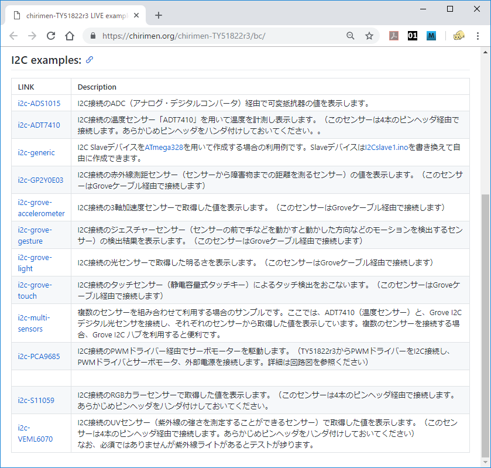
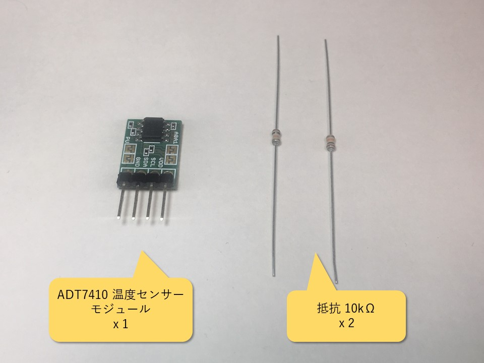
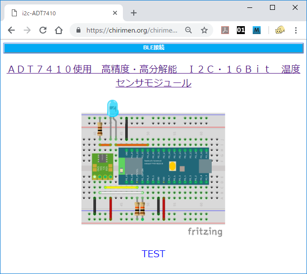
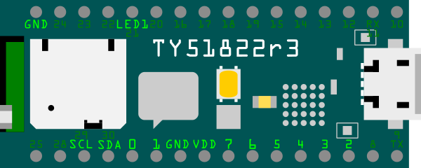
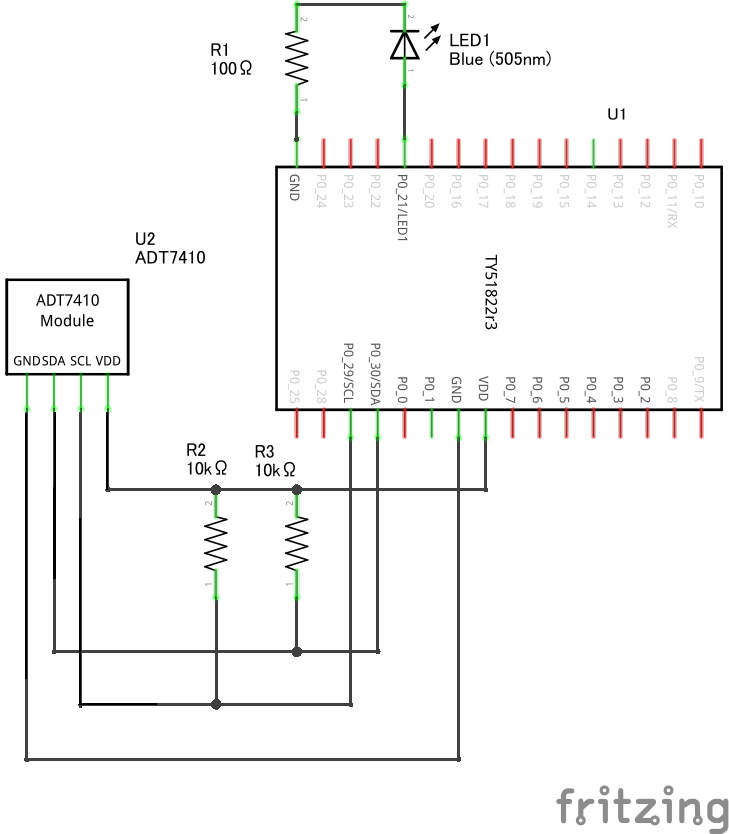
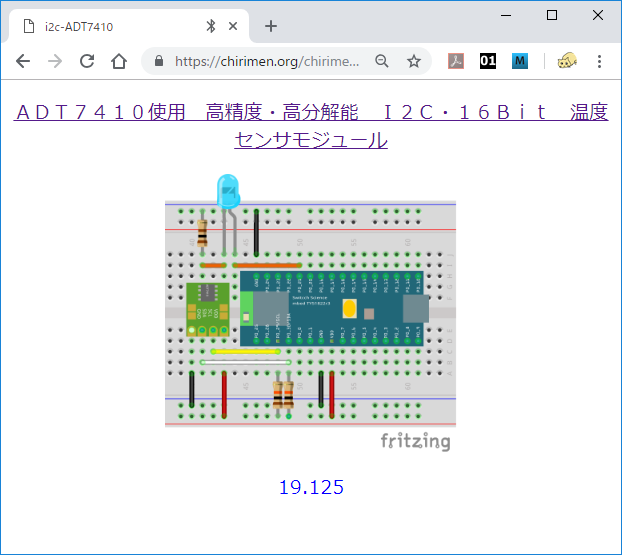
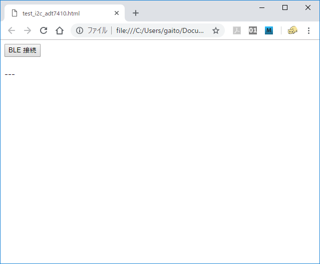
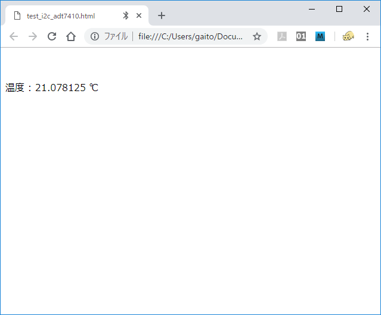

# 2. I2C 基礎編

# 概要

CHIRIMEN for TY51822r3 を使ったプログラミングを通じて、[Web I2C API](https://rawgit.com/browserobo/WebI2C/master/index.html) の使い方を学びます。

## 前回までのおさらい

本チュートリアルを進める前に「[Hello World 編](section1.md)」と、「[GPIO 編](section1.md)」で CHIRIMEN for TY51822r3 の基本的な操作方法とプログラミング方法を確認しておいてください。

前回までのチュートリアルで学んだことは下記のとおりです。

* CHIRIMEN for TY51822r3 の各種 examples は [chirimen-TY51822r3 LIVE examples](https://chirimen.org/chirimen-TY51822r3/bc/) のページにある。
* CHIRIMEN for TY51822r3 では GPIO として 0 番 ～ 7 番が利用できる。
* CHIRIMEN for TY51822r3 では Web アプリからの GPIO の制御には [Web GPIO API](http://browserobo.github.io/WebGPIO/) を利用する。GPIO ポートは「出力モード」に設定することで LED の ON/OFF などが行える。また「入力モード」にすることで、GPIO ポートの状態を読み取ることができる。
* [async function](https://developer.mozilla.org/ja/docs/Web/JavaScript/Reference/Statements/async_function) を利用すると非同期処理のコードがすっきり書ける。

# 1. 準備

## 用意するもの

このチュートリアル全体で必要になるハードウエア・部品は下記の通りです。

* [Hello World 編](section0.md) に記載の「基本ハードウエア」
* [ADT7410 使用 温度センサーモジュール](http://akizukidenshi.com/catalog/g/gM-06675/) x 1 

# 2. I2C とは

[I2C](https://ja.wikipedia.org/wiki/I2C) は 2 線式の同期式シリアル通信インタフェースです。「アイ・スクエア・シー」とか「アイ・ ツー・シー」などと読みます。 


上図のように I2C の SDA、SCL は複数のデバイス間で共有します。（「I2C バス」と言います。）

SDA（シリアルデータ）と SCL（シリアルクロック）の2本の線だけで複数のデバイスとの通信を行う事ができる事が特長で、
例えば温度や光などを検知する各種のセンサーや出力装置でも I2C に対応したものが多くあり、いわゆる IoT 関係のアプリでも広く使用されています。

I2C ではマスターとスレーブの間で通信が行われ、常にマスター側からスレーブ側に要求が行われます。スレーブ側からマスター側へ要求を行うことはできません。
CHIRIMEN for TY51822r3 ではマスターとなるのが TY51822r3 で、各種のセンサー等がスレーブとなります。

マスターは、各スレーブがそれぞれ持つ「スレーブアドレス」を用いて、特定のスレーブとの通信を行います。このため、同じ I2C バス上に同じアドレスのスレーブを繋ぐことはできません。


ブレッドボードで使えるようにモジュール化されたセンサー等、通信するデバイス同士が同一基板上にない場合には SDA、SCL の2本の通信線に加え電源と GND の線を加えて 4 本のケーブルを用いて接続するのが一般的です。

詳細は下記をご参照ください。

* [I2C](https://ja.wikipedia.org/wiki/I2C) - Wikipedia
* I2Cバス仕様書　最新版（[日本語](https://www.nxp.com/docs/ja/user-guide/UM10204.pdf)、[English](http://www.nxp.com/documents/user_manual/UM10204.pdf)）
* [I2Cの使い方](http://www.picfun.com/i2cframe.html)（後閑哲也氏サイト)

ここでは I2C の概要として下記を押さえておきましょう。

* I2C には複数のデバイスが繋がる（I2C バス）
* I2C に繋がるデバイスにはマスターとスレーブがある
* I2C では必ずマスターからスレーブに対して通信要求が行われる
* I2C スレーブはそれぞれのスレーブアドレスを持っている
* 同じ I2C バスに同じスレーブアドレスのスレーブは接続できない

# 3. 温度センサー (ADT7410) を使ってみる

それでは実際に I2C に対応したモジュールを使ってみましょう。

CHIRIMEN for TY51822r3 には、センサーなど、いくつかの I2C モジュールのサンプルが含まれています。  
[LIVE examples](https://chirimen.org/chirimen-TY51822r3/bc/) のページに I2C 対応デバイスを使った examples のリストがありますので、アクセスしてみてください。



この中から、ADT7410という温度センサーモジュールを使ってみたいと思います。
I2Cバス上、TY51822r3 がマスター、ADT7410がスレーブになります。

次のリンクで ADT7410 を使った LIVE example ページが開きます。

[i2c-ADT7410](https://chirimen.org/chirimen-TY51822r3/bc/i2c/i2c-ADT7410/)

## a. 部品と配線について

基本セット以外に必要な部品は次の通りです。



今回使用する ADT7410 は秋月電子で販売されているブレッドボードで使えるようにモジュール化されたものです。

[ADT7410使用 I2C 温度センサーモジュール](http://akizukidenshi.com/catalog/g/gM-06675/)

基板とピンヘッダーが同梱されていますが、できれば、L 字型のピンヘッダーを半田付けしてブレッドボードに差した時に立てられるようにした方が使いやすいかも知れません。

さて、[**i2c-ADT7410 の LIVE example**](https://chirimen.org/chirimen-TY51822r3/bc/i2c/i2c-ADT7410/) のページでは、次のようにブレッドボードの配線図付きで ADT7410 を使用した温度センサーのアプリが開きます。これらのパーツを画面の通りに接続してみてください。

[](https://chirimen.org/chirimen-TY51822r3/bc/i2c/i2c-ADT7410/schematic.png)  

I2C の信号、SCL、SDA はこの図で TY51822r3 の 左下、P0_29 と P0_30 に割り当てられています。
これは CHIRIMEN for TY51822r3 の環境での割り当てであって MBED の TY51822r3 公式ページでのピン割り当てとは異なる事に注意してください。

また、SCL、SDA の信号は I2C の仕様上プルアップしておく必要があり、2 本の 10kΩ の抵抗はそのために使用されています。



回路図は次の通りです。  



## b. example を実行してみる

それでは、さっそく動かしてみましょう。

[**i2c-ADT7410 の LIVE example**](https://chirimen.org/chirimen-TY51822r3/bc/i2c/i2c-ADT7410/) のページで、
画面上部の青いバー「BLE 接続」のボタンを押すと、BLE の接続を開始します。  
ターゲットの gtGPIO2 を選択して「ペア設定」を押してください。


BLE の接続が正常にできれば、青いバーが消え動作を開始します。  
ブレッドボード図の下に数字がでていますね。これが温度センサーから取得した現在の温度 (摂氏) の表示になります。  



温度センサーが現在の温度を I2C で送り出し、Web I2C API 経由でWebアプリが読み取り、画面に情報を表示しています。
温度の表示は 1 秒毎に更新されていますので、ADT7410 センサーに指で触れるなどすると徐々に温度が上がって数値が変化すると思います。

# 4. 温度センサー (ADT7410) example のコードを読んでみる

それでは、コードを見てみましょう。

この example のコードは GitHub のリポジトリ chirimen-oh/chirimen-TY51822r3 内にあります。

[GitHub : chirimen-oh/chirimen-TY51822r3/bc/i2c/i2c-ADT7410](https://github.com/chirimen-oh/chirimen-TY51822r3/tree/master/bc/i2c/i2c-ADT7410)

## index.html

下記が index.html の中から主要な部分を抜き出したコードです。

index.html
```html
  <script src="../../polyfill/blePolyfill.js"></script>
  <script src="../../drivers/i2c-ADT7410.js"></script>
  <script src="./main.js"></script>
  <body>
    <div><input type="button" id="BLECONN" value="BLE接続"></div>
    <p id="head">TEST</p>
  </body>
```

まず最初に読み込んでいる `blePolyfill.js` は Web GPIO API の example の時にも出てきましたが、[Web GPIO API](http://browserobo.github.io/WebGPIO/) と、[Web I2C API](http://browserobo.github.io/WebI2C/) をサポートするためのポリフィルです。

次に読み込んでいる `i2c-ADT7410.js` は Web I2C API を使って温度センサー ADT7410 との通信を行うためのドライバーとなるライブラリです。

最後に読み込んでいる `main.js` が、ドライバーライブラリを使ってこのアプリケーションの動作を記述している部分です。

また HTML の部品として、BLE を接続して動作を開始するボタンのための`<input>`タグと、読み取った温度を表示する場所として`<p>`タグが準備されています。

## main.js

次に、`main.js` を見てみましょう。
この `mainFunction()` が「BLE 接続」のボタンが押され、動作開始と共に走る関数です。

main.js
```javascript
async function mainFunction() {
  try {
    var bleDevice = await navigator.bluetooth.requestDevice({
      filters: [{ services: [DEVICE_UUID] }] });
    var i2cAccess = await navigator.requestI2CAccess(bleDevice);
    connectButton.hidden = true;
    var port = i2cAccess.ports.get(1);
    var adt7410 = new ADT7410(port, 0x48);
    await adt7410.init();
    while (1) {
      var value = await adt7410.read();
      // console.log('value:', value);
      head.innerHTML = value ? value : head.innerHTML;
      await sleep(1000);
    }
  } catch (error) {
    console.error("error", error);
  }
}

```

ここで温度センサーの情報を定期的に取得し、画面に出力する処理が行われています。
少し詳し解説してみます。

### await navigator.bluetooth.requestDevice()
GPIO の example の時と同様ですが、まずこの呼び出しによって周辺デバイスをスキャンして BLE デバイスを選択するダイアログを表示します。  

`requestDevice({filters: [{ services: [DEVICE_UUID] }] })` と引数に DEVICE_UUID で CHIRIMEN-TY51822r3 用のサービスを指定しています。

この呼び出しは非同期処理で `await` が付いていますのでここで一時停止し、ユーザーがダイアログでデバイスを選択した時点で次の処理に進みます。

### await navigator.requestI2CAccess()

Web I2C APIを利用するための `I2CAccess` インタフェースを取得するための API 呼び出しです。  
Web GPIO の場合は `requestGPIOAccess()` でしたが Web I2C の場合はこのように `requestI2CAccess()` となります。

この関数も非同期処理の関数で、処理完了を待機し、その結果正しくインタフェースが取得されたら `i2cAccess` オブジェクトに保持されます。

### i2cAccess.ports.get()

`I2CAccess.ports` は、利用可能な I2C ポートの一覧です。

```javascript
  var port = i2cAccess.ports.get(1);
```

CHIRIMEN for TY51822r3 で利用可能なI2Cポート番号は `1` 番だけです。
ここでは、ポート番号に `1` を指定して、`port` オブジェクトを取得しています。

### var adt7410 = new ADT7410(port, 0x48)

ここで ADT7410 用のドライバーライブラリのインスタンス生成を行なっています。
`0x48` は ADT7410 が固定で持っている I2C のスレーブアドレスです。

なお、この ADT7410 モジュールでは、デフォルトでスレーブアドレスが `0x48` ですが、基板上のジャンパーを半田でショートする事により `0x48` ～ `0x4B` の間で選択する事ができます。複数の I2C デバイスを接続するときに衝突を避けられるようにこのような構造になっているモジュールが一般的です。

### await adt7410.init()

ADT7410 用のドライバーライブラリのインスタンス (adt7410) が持つ非同期処理の関数 `init()` は、その内部でインスタンス生成時に指定した `port` オブジェクトとスレーブアドレス `0x48` を用いて `I2CPort.open()` を行なっています。

`I2CPort.open()` が成功すると、`I2CSlaveDevice` という I2C ポートへデータ書き込みや読み込みなどを行うインタフェースが返されます。
`I2CSlaveDevice` インタフェースは、ライブラリ内に保存され、その後の処理でこのインターフェースを使って I2C デバイスである adt7410 との通信が可能になります。

### await adt7410.read()

ADT7410 の仕様に基づくデータ読み出し処理をここで行っています。

内部では、`I2CSlaveDevice.read8()` という API を 2 回呼び出すことで、温度データの [MSB](https://ja.wikipedia.org/wiki/最上位ビット), [LSB](https://ja.wikipedia.org/wiki/最下位ビット) を 8bit ずつ読み出し、両方の読み出しが終わった時点で MSB と LSB を合成、16bit データとしたのちに、温度データに変換して返却しています。

### I2C デバイスのドライバーの役割

この example では ADT7410 から値を読み出すために ADT7410 専用のドライバー `i2c-ADT7410.js` を使用しています。このように CHIRIMEN for TY51822r3 ではある程度の I2C デバイスに関しては簡単に使えるように専用のドライバーが準備されています。次のフォルダーに各デバイスのドライバーが収められています。

[GitHub の I2C ドライバー一覧フォルダー](https://github.com/chirimen-oh/chirimen-TY51822r3/tree/master/bc/drivers)  


example ではドライバーの読み込みに相対 URL を使用していますが、ローカルファイルで HTML を作成する場合は、
```html
<script src="https://chirimen.org/chirimen-TY51822r3/bc/drivers/i2c-ADT7410.js"></script>
```
のようにドライバーの公開 URL を指定してください。

これらの I2C デバイスのドライバーは基本的にはどれも同じ使い方ができるように作られています。つまり

* device = new Device_Name(port, Slave_Address)
  * I2C ポートとスレーブアドレスを指定してインターフェイスオブジェクトを作成します。
* device.init()
  * ドライバーの初期化を行います。デバイスによっては引数で動作のオプションを指定する場合もあります。
  内部では `I2CPort.open()` を呼び出し `I2CSlaveDevice` を取得します。
* device.read()
  * 実際にデバイスにアクセスして値を読み出します。内部では `I2CSlaveDevice.read8()` 等のメソッドが使われます。なお、これは何らかの値を読み取る一般的なセンサー系デバイスの場合で、デバイスの機能によっては違う名前のメソッドが準備されています。

と言うような使い方になります。

さて、この example での Web I2C API に関する処理を ADT7410 ドライバー内部も含めてまとめると以下のようなことが行われています。

1. await navigator.bluetooth.requeceDevice() で BLE デバイスをユーザーが選択
2. await navigator.requestI2CAccess(bleDevice) で I2CAccess インタフェースを取得
3. i2cAccess.ports.get(1) で、1番ポートの `port` オブジェクトを取得
4. await port.open(0x48) で、スレーブアドレス 0x48 番の I2CSlaveDevice インタフェースを取得
5. i2cSlave.read8() で 温度データ を読み込み (ADT7410 の場合、常に2回セット)

という流れになります。

この流れは、ADT7410 以外の他の I2C デバイスでも基本的に同様で、I2C デバイスにより変わるのは、`port.open()`に指定するスレーブアドレスと、5. の実際の処理の部分になります。これを押さえておけば、ドライバーが準備されていない I2C デバイスでもそれに対応するコードを書くのはそれほど難しくありません。

新たな I2C デバイスへの対応方法については、下記記事も参考にしてください。

(CHIRIMEN for TY51822r3 ではなく、CHIRIMEN ボード向けの記事ですが、Web I2C API への対応に関しては同じ方法で対応が可能です)

[CHIRIMENでI2Cデバイスを使ってみる](https://qiita.com/tadfmac/items/04257bfe982ba0f050bb)

# 5. 温度センサー(ADT7410)の値をドライバーを使わずに読む

さて、I2C デバイスのドライバーが既にあればそれを使うのが簡単なのですが、ドライバーがなくても直接 I2C でデバイスに Web I2C API でアクセスして動かす事も可能で、現在ドライバーが準備されていない新たな I2C デバイスのドライバーを作成する事も可能です。

次は Web I2C API を使ってデバイスに直接アクセスしてみます。

Web I2C API で直接アクセスするにはまず I2C デバイスのデータシート等から内容を把握しておく必要があります。I2C デバイスの内部には読み込みや書き込みが可能なレジスターがあり、それぞれのレジスターにアドレスが割り振られています。ADT7410 の場合は次のようになっています。

|アドレス|説明                 |デフォルト値|
|-------|---------------------|-----------|
|0x00   |Temperature value MSB|0x00       |
|0x01   |Temperature value LSB|0x00       |
|0x02   |Status               |0x00       |
|0x03   |Configuration        |0x00       |
|0x04   |T high setpoint MSB  |0x20(64℃) |
|0x05   |T high setpoint LSB  |0x20(64℃) |
|0x06   |T low setpoint MSB   |0x20(10℃) |
|0x07   |T low setpoint LSB   |0x20(10℃) |
|0x08   |T crit setpoint MSB  |0x49(147℃)|
|0x09   |T crit setpoint LSB  |0x80(147℃)|
|0x0a   |T hyst setpoint      |0x05(5℃)  |
|0x0b   |ID                   |0xCX       |
|0x2f   |Software reset       |0xXX       |

多数のレジスターがありますが、取り合えず今現在の温度を知りたいだけであれば、
アドレス `0x00` と `0x01` の Temperature value MSB と LSB の値を読むだけで良さそうです。

ADT7410 の温度測定の精度には 13 ビットモードと 16 ビットモードがあり、デフォルトは 13 ビットモードです。
せっかく直接アクセスするのですから、ここでは 16 ビットモードに切り替えてみましょう。
アドレス `0x03` の Configuration レジスタに `0x80` を書き込めば 16 ビットモードになります。
そして `0x00` と `0x01` のそれぞれのレジスターから 8 ビットの値が読み出せますので繋ぎ合わせて 16 ビットの値にして 128 で割る事で摂氏温度が得られます。

それでは、ADT7410 ドライバー内部での処理の流れがだいたいわかったところで、ドライバーを使わずに自力で値を読み込むコードを一応書いてみましょう。
適当なフォルダーに HTML ファイルを作成してください。

まずは、`blePolyfill` の読み込みを行い、HTML の部品としては BLE の接続開始ボタンと温度表示用の `div` のタグを準備しておきます。ポリフィルの URL は公開されている絶対 URL を使用します。

```html
<script src="https://chirimen.org/chirimen-TY51822r3/bc/polyfill/blePolyfill.js"></script>
<button id="connect">BLE 接続</button><br/><br/>
<div id="ADT7410value">---</div>
```

JavaScript の方では、example でいつも使っている DEVICE_UUID を定義します。

```javascript
const DEVICE_UUID = "928a3d40-e8bf-4b2b-b443-66d2569aed50";
```

そして BLE 接続ボタンを押した時に走らせる mainFunction() が次のようになります。
今回は定期的なポーリング処理が必要になるので、[GPIO編 c. スイッチに反応するようにする (port.read()を使ってみる)](section1.md#c--portread) の時に書いたコードが参考になります。

BLE デバイスの選択、 i2Access オブジェクトの取得、1番ポートの取得、スレーブアドレス `0x48` のスレーブデバイスの取得、そして Configuration レジスタへの 16 ビットモードの設定、で初期化は終了です。

```javascript
async function mainFunction() {
  var bleDevice = await navigator.bluetooth.requestDevice({ filters: [{ services: [DEVICE_UUID] }] });
  document.getElementById("connect").hidden = true;
  var i2cAccess = await navigator.requestI2CAccess(bleDevice);
  var adt7410value = document.getElementById("ADT7410value");

  var port = i2cAccess.ports.get(1);          // I2C I/F の 1番ポートを取得
  var i2cSlaveDevice = await port.open(0x48); // スレーブアドレス 0x48
  await i2cSlaveDevice.write8(0x03,0x80);     // 16 ビットモード設定
  ・
  ・
```

その後は 1 秒に 1 回のポーリングで温度の読み取りを行います。
`0x00` と `0x01` のレジスタを読み取り温度の値に変換して表示しています。

```javascript
  ・
  ・
  var MSB, LSB, temperature;
  for (;;) {                                  // 無限ループ
    MSB = await i2cSlaveDevice.read8(0x00);   // これ以下の３行が肝です
    LSB = await i2cSlaveDevice.read8(0x01);
    temperature = ((MSB << 8) | (LSB & 0xff)) / 128.0;
    adt7410value.innerHTML = `温度 : ${temperature} ℃`;
    await sleep(1000);
  }
}
document.getElementById("connect").onclick = mainFunction;
```

プログラムが書けたら動かしてみてください。
起動すると下のような画面が表示さます。



「BLE 接続」のボタンを押して接続を開始します。


BLE デバイスを選択すると動作を開始します。



温度センサーの値が表示されるはずです。16 ビットモードに設定したので LIVE examples のプログラムよりも温度表示の桁数が増えているのがわかるでしょうか。
センサーの ADT7410 を指で触るなどすると温度が変化しますので確認してみてください。

全体をまとめたプログラムへのリンクがここにあります。
[test_i2c_adt7410.html](examples/test_i2c_adt7410.html)

# まとめ

このチュートリアルでは下記について学びました。

* I2Cの基礎知識
* Web I2C API を使った処理の流れ
* ADT7410 温度センサーの制御方法

このチュートリアルで書いたコードは以下のページで参照できます:

* [GitHub リポジトリで参照](https://github.com/chirimen-oh/tutorials-TY51822r3/tree/master/ble/ja/examples)
* ブラウザで開くページ
  * [ADT7410 温度センサー (ドライバを使わないコード例)](https://github.com/chirimen-oh/tutorials-TY51822r3/tree/master/ble/ja/examples/test_i2c_adt7410.html)


次の『[チュートリアル 3. I2C　応用編（その他のセンサー）](section3.md)』では測距センサーや光センサーなど他のセンサーも触っていきます。

