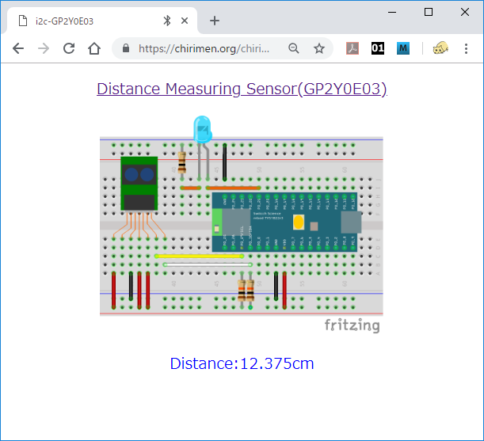
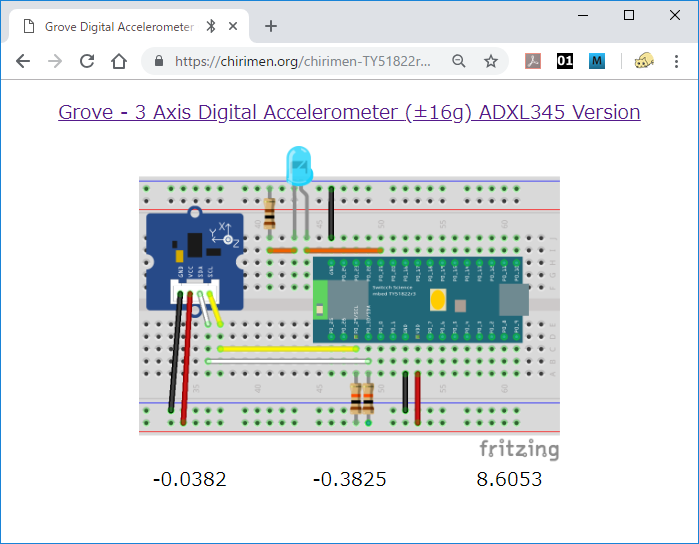
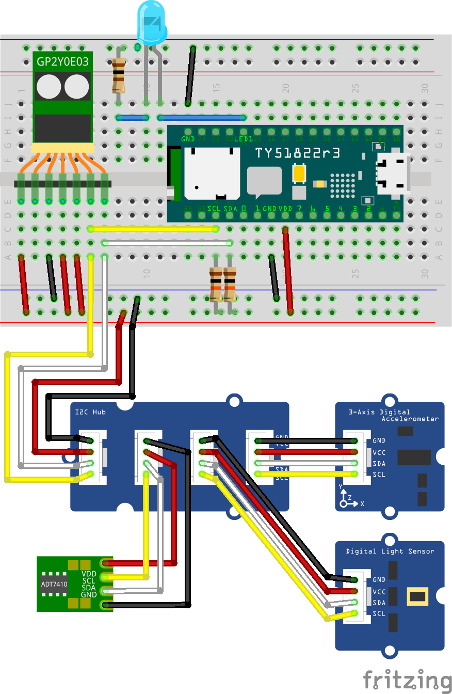

# 3. I2C 応用編

# 概要

CHIRIMEN for TY51822r3 を使ったプログラミングを通じて、Web I2C API の使い方を学びます。 

前回は温度センサーを使いながら Web I2C API の基本的な利用方法を学びました。今回は温度センサー以外の I2C センサーの使い方を見ていきましょう。

ここでは例として測距センサー、光センサー、加速度センサーの 3 つについて詳しく説明していますが、最後に「他の I2C モジュールも使ってみる」として紹介しているように、CHIRIMEN for TY51822r3 ではそれ以外にも多くの I2C デバイス (あるいは I2C の ADC を使って様々なアナログセンサー類) が簡単に扱えるようになっています。各自興味のあるセンサーを順に試していってください。

## 前回までのおさらい

本チュートリアルを進める前に前回までのチュートリアルを進めておいてください。

* [Hello World 編](section0.md)
* [GPIO 編](section1.md)
* [I2C 基礎編](section2.md)

前回までのチュートリアルで学んだことは下記のとおりです。

* CHIRIMEN for TY51822r3 の各種 examples は [chirimen-TY51822r3 LIVE examples](https://chirimen.org/chirimen-TY51822r3/bc/) のページにある。
* CHIRIMEN for TY51822r3 では GPIO として 0 番 ～ 7 番が利用できる。
* CHIRIMEN for TY51822r3 では Web アプリからの GPIO の制御には Web GPIO API を利用する。GPIOポートは「出力モード」に設定することで LED の ON/OFF などが行える。また「入力モード」にすることで、GPIO ポートの状態を読み取ることができる
* [async function](https://developer.mozilla.org/ja/docs/Web/JavaScript/Reference/Statements/async_function) を利用すると複数ポートの非同期コードがすっきり書ける
* CHIRIMEN for TY51822r3 では Web アプリから I2C 通信に対応したモジュールの制御に [Web I2C API](http://browserobo.github.io/WebI2C/) を利用することができる


# 1. 準備

## 用意するもの

このチュートリアル全体で必要になるハードウエア・部品は下記の通りです。

* [Hello World 編](section0.md) に記載の「基本ハードウエア」
* [ADT7410 使用 温度センサーモジュール](http://akizukidenshi.com/catalog/g/gM-06675/) x 1 
* [シャープ測距モジュール GP2Y0E03](http://akizukidenshi.com/catalog/g/gI-07547/) x 1
* [GROVE - I2C デジタル光センサー](https://www.switch-science.com/catalog/1174/) x 1
* [GROVE - I2C 三軸加速度センサー ADXL345搭載](https://www.switch-science.com/catalog/972/) x 1
* [GROVE - I2C ハブ](https://www.switch-science.com/catalog/796/) x 1
* [GROVE - 4ピン メスケーブル](https://www.switch-science.com/catalog/1048/)
* ジャンパーケーブル オス-オス x 適宜

# 2. 測距センサーを繋いでみる

前回までで温度センサー ADT7410 の使い方が一通りわかった所で、今度は他のセンサーとして測距センサー GP2Y0E03 を接続してみましょう。
GP2Y0E03 測距センサーは光学式の距離測定モジュールです。赤外 LED で発した光の対象物での反射を検出して 4 ～ 50 cm 程度の範囲の対象物までの距離を測定できます。

このセンサーモジュールには細い7本のケーブルが付属していますが、このままではブレッドボードで使いにくいので、この細いケーブルを 2.54mm ピッチのピンヘッダーに半田付けするなどして加工する必要があります。

[測距センサーモジュール GP2Y0E03](http://akizukidenshi.com/catalog/g/gI-07547/)　(ケーブル加工済)  


この測距センサーを使用した例は LIVE example として既に準備されています。

[CHIRIMEN for TY51822r3 LIVE examples](https://chirimen.org/chirimen-TY51822r3/bc/) の一覧に [i2c-GP2Y0E03](https://chirimen.org/chirimen-TY51822r3/bc/i2c/i2c-GP2Y0E03/) という example がありますのでそれを開いてください。 example のアプリが起動し、ブレッドボード図が表示されます。  

このセンサーは電源がコア部と IO 部に分かれていたり、アナログ出力を持っている等の事情で端子数が 7 本と多くなっていますが、TY51822r3 からの制御のために使用するのは温度センサーの時と同じく SDA、SCL の 2 本の信号線です。

[i2c-GP2Y0E03 LIVE example](https://chirimen.org/chirimen-TY51822r3/bc/i2c/i2c-GP2Y0E03/)  
[](https://chirimen.org/chirimen-TY51822r3/bc/i2c/i2c-GP2Y0E03/schematic.png)

図の通りに配線して「BLE 接続」のボタンを押し、動作させるとセンサーから障害物までの距離 (cm) が表示されます。センサーの前に手をかざすなどすると表示が変化するのがわかると思います。



## コードを見てみる

それではこの examples のコードを見てみましょう。この example のコードは [GitHub : bc/i2c/i2c-GP2Y0E03](https://github.com/chirimen-oh/chirimen-TY51822r3/tree/master/bc/i2c/i2c-GP2Y0E03) にあります。

次のコードが HTML からの抜粋です。
```html
<script src="../../polyfill/blePolyfill.js"></script>
<script src="../../drivers/i2c-GP2Y0E03.js"></script>
・
・
・
<div><input type="button" id="BLECONN" style="width:100%;background-color:#03A9F4;color:#fff;font-weight: bold;" value="BLE接続"></div>
<p id="distance">init</p>
```

HTML のコードを見ると ADT7410 の example とほぼ同じ構造になっているのがわかると思います。異なる点としては、まず読み込む I2C デバイスのドライバーが ADT7410 用ではなくて GP2Y0E03 用のドライバー `i2c-GP2Y0E03.js` になっています。  

そして次が Javascript 部分の抜粋です。

```javascript
const DEVICE_UUID     = "928a3d40-e8bf-4b2b-b443-66d2569aed50";
let connectButton;

async function mainFunction() {
  var sensor_unit;
  var bleDevice = await navigator.bluetooth.requestDevice({
    filters: [{ services: [DEVICE_UUID] }] });
  var i2cAccess = await navigator.requestI2CAccess(bleDevice);

  var port = i2cAccess.ports.get(1);
  sensor_unit = new GP2Y0E03(port, 0x40);
  await sensor_unit.init();

  while (1) {
    var distance = await sensor_unit.read();
    if (distance != null) {
      valelem.innerHTML = "Distance:" + distance + "cm";
    } else {
      valelem.innerHTML = "out of range";
    }
  } catch (err) {
    console.log("READ ERROR:" + err);
  }
  await sleep(500);
}
```

* `DEVICE_UUID` の宣言  
* `navigator.bluetooth.requestDevice()` による `bleDevice` の取得  
* `navigator.requestI2CAccess(bleDevice)` による `i2cAccess` の取得  
* `i2cAccess.ports.get()` による `port` の取得  

と温度センサーの場合と同じ処理が順次行われています。

そして次に測距センサーのドライバーのインタンスの作成です。
取得した `port` と GP2Y0E03 のデフォルトのスレーブアドレス `0x40` を使用して `new GP2Y0E03(port, 0x40)` によってドライバーのインスタンスを作成しています。

インスタンスを作成した後は、ADT7410 の時と同様に `init()` によって初期化を行い、その後ポーリングで `read()` の呼び出しによって cm 単位の距離データを読み出して表示する処理を繰り返します。

`read()` で得られる値は cm 単位の数値ですが、このセンサーの場合には距離が「測定範囲外」の場合 `null` が返されますので、表示の際にその対応をしています。このようにセンサー系のドライバーの多くは同じ `read()` メソッドをサポートしていますが、センサーのドライバーによっては返される値に違う形式が使われる場合があります。

# 3. その他の I2C デバイス

最後に、その他の I2C デバイスとして **Grove I2C** のモジュールを使う例を紹介します。

Grove システムというのは 色々なセンサーやアクチュエーターを搭載した小さなモジュールを共通規格化して 4 ピンケーブルで繋ぎ合わせて、簡単に電子工作の実験などができるようにしたシステムです。  

Grove システムのモジュールにはインターフェースの種類として Analog / Digital 等幾つかの種類があるのですが、ここで使うのは「Grove I2C」と呼ばれるもので I2C のインターフェースに対応したモジュールです。見かけ上は I2C 以外の Grove モジュールも同じコネクタなので注意してください。

この Grove I2C のセンサーモジュールとして以下の二つを試してみます。

[Grove - I2C デジタル光センサー](https://www.switch-science.com/catalog/1174/)


[GROVE - I2C 三軸加速度センサー ADXL345 搭載](https://www.switch-science.com/catalog/972/)


CHIRIMEN for TY51822r3 ではこの 2 つのモジュール用にそれぞれドライバーが準備されており、それを使用した [LIVE example](https://chirimen.org/chirimen-TY51822r3/bc/) があります。


## デジタル光センサー  

周囲の明るさを検出するセンサーです。
LIVE example は以下の場所にあります。

[LIVE example : i2c-grove-light](https://chirimen.org/chirimen-TY51822r3/bc/i2c/i2c-grove-light/)  
[](https://chirimen.org/chirimen-TY51822r3/bc/i2c/i2c-grove-light/schematic.png)

LIVE example を開くとアプリが起動し、ブレッドボード図が表示されます。配線としては、今までの I2C デバイスの example と同じで I2C の信号 SDA、SCL の先に接続する I2C モジュールが変更されているだけです。

このアプリのコードは以下の場所にあります。

[コード (GitHub) : chirimen-oh/chirimen-TY51822r3/bc/i2c/i2c-grove-light](https://github.com/chirimen-oh/chirimen-TY51822r3/tree/master/bc/i2c/i2c-grove-light)  

ドライバーファイルは次の行で読み込まれています。

```html
<script src="../../drivers/i2c-grove-light.js"></script>
```

絶対 URL から読み込む場合は

```html
<script src="https://chirimen.org/chirimen-TY51822r3/bc/drivers/i2c-grove-light.js"></script>
```
としてください。

ドライバーのインスタンス生成は次のようになっています。スレーブアドレスは `0x29` です。

```javascript
  var groveLight = new GROVELIGHT(port, 0x29);
```

次のように `read()` の呼び出しによってセンサーが出力する明るさを得る事ができます。出力する値は数値で単位は Lux (ルクス) です。

```javascript
var value = await groveLight.read();
```


## GROVE - I2C 三軸加速度センサー ADXL345  

次にまた別の Grove I2C 対応のセンサーとして三軸加速度センサーの例を見てみます。  

これは x、y、z 三方向の加速度を検出するセンサーです。静止状態では重力の向きに対してセンサーがどちらを向いているかを知る事ができます。
LIVE example は以下の場所にあります。

[LIVE example : i2c-grove-accelerometer](https://chirimen.org/chirimen-TY51822r3/bc/i2c/i2c-grove-accelerometer/)  
[](https://chirimen.org/chirimen-TY51822r3/bc/i2c/i2c-grove-accelerometer/schematic.png)  

LIVE example のアプリを起動して表示されるブレッドボード図を見ると光センサーと同じで Grove のセンサーモジュールが違うだけですね。  

このアプリのコードは以下の場所にあります。

[コード (GitHub) : chirimen-oh/chirimen-TY51822r3/bc/i2c/i2c-grove-accelerometer/](https://github.com/chirimen-oh/chirimen-TY51822r3/tree/master/bc/i2c/i2c-grove-accelerometer)  

ドライバーファイル `i2c-grove-accelerometer.js` は次の行で読み込まれています。

```html
<script src="../../drivers/i2c-grove-accelerometer.js"></script>
```

絶対 URL から読み込む場合は

```html
<script src="https://chirimen.org/chirimen-TY51822r3/bc/drivers/i2c-grove-accelerometer.js"></script>
```
となります。

`DEVICE_UUID` の宣言、`navigator.bluetooth.requestDevice()` による `bleDevice` の取得、`navigator.requestI2CAccess(bleDevice)` による `i2cAccess` の取得、`i2cAccess.ports.get()` による `port` の取得、と光センサーの場合とまったく同じ手順です。
そして、ドライバーのインスタンス生成は次のようになっています。スレーブアドレスは `0x53` です。

```javascript
  var groveAccelerometer = new GROVEACCELEROMETER(port, 0x53);
```

センサーからの値を取るために光センサーの時と同様に `read()` を呼び出しています。

```javascript
  var values = await groveAccelerometer.read();
```

ただしここで返される値は数値ではなく、三方向の加速度の値をまとめたオブジェクトとして返されます。
返されたオブジェクトの各プロパティ `values.x`、`values.y`、`values.z` が三方向のそれぞれの加速度となっています。
返される加速度の単位は m/s&sup2; です。

静止状態にある場合はセンサーが重力に対してどちらを向いているかを知る事ができますのでセンサーを傾ける等をすると数値が変わります。

## 色々なセンサーをまとめて繋いでみる

これらの GROVE I2C のモジュールは専用の 4 ピンケーブルで接続する事になりますが、1 つの I2C バスに複数のモジュールを接続する場合には Grove I2C ハブと呼ばれる分配用のモジュールを使う事でまとめて接続する事が可能です。

Grove I2C ハブ経由での接続は次のようになります。  

[GROVE I2C ハブ](https://www.switch-science.com/catalog/796/)


せっかくですからここまでで紹介した I2C センサーを全部まとめて繋いでみます。Grove I2C HUB 経由で繋いだ例が下の図です。




では全部のセンサーからのデータを読み取るプログラムを書いてみましょう。  

HTML では `blePolyfill.js` と各センサーのドライバーを読み込みます。
また画面には、「BLE 接続」のボタンと各センサーの値を表示する場所を作っておきます。

```html
<script src="https://chirimen.org/chirimen-TY51822r3/bc/polyfill/blePolyfill.js"></script>
<script src="https://chirimen.org/chirimen-TY51822r3/bc/drivers/i2c-ADT7410.js"></script>
<script src="https://chirimen.org/chirimen-TY51822r3/bc/drivers/i2c-GP2Y0E03.js"></script>
<script src="https://chirimen.org/chirimen-TY51822r3/bc/drivers/i2c-grove-light.js"></script>
<script src="https://chirimen.org/chirimen-TY51822r3/bc/drivers/i2c-grove-accelerometer.js"></script>

<button id="connect">BLE 接続</button><br/><br/>

<table>
<tr><th colspan="2">温度</th><td id="ADT7410value"></td></tr>
<tr><th colspan="2">距離</th><td id="GP2Y0E03value"></td></tr>
<tr><th colspan="2">明るさ</th><td id="GROVELIGHTvalue"></td></tr>
<tr><th rowspan="3">加速度</th><th>X</th><td id="GROVEACCELEROMETERXvalue"></td></tr>
<tr><th>Y</th><td id="GROVEACCELEROMETERYvalue"></td></tr>
<tr><th>Z</th><td id="GROVEACCELEROMETERZvalue"></td></tr>
</table>
```

JavaScript 側では `DEVICE_UUID` を宣言、`bleDevice` の取得、`i2cAccess` の取得、`port` の取得とこれまでと同じ手順で I2C ポートを得た後、4 つのセンサーを順次初期化します。

```javascript
const DEVICE_UUID = "928a3d40-e8bf-4b2b-b443-66d2569aed50";
async function mainFunction() {
  var bleDevice = await navigator.bluetooth.requestDevice({ filters: [{ services: [DEVICE_UUID] }] });
  var i2cAccess = await navigator.requestI2CAccess(bleDevice);
  document.getElementById("connect").hidden = true;

  var port = i2cAccess.ports.get(1);          // I2C I/F の 1番ポートを取得
  var adt7410 = new ADT7410(port,0x48);
  var gp2y0e03 = new GP2Y0E03(port,0x40);
  var grovelight = new GROVELIGHT(port,0x29);
  var groveaccel = new GROVEACCELEROMETER(port,0x53);

  await adt7410.init();
  await gp2y0e03.init();
  await grovelight.init();
  await groveaccel.init();
  ...
```

後は 1 秒に 1 回の無限ループで各センサーからの値を読み取り、表示するだけです。  

値の読み取りはどのセンサーのインスタンスも `read()` を呼ぶだけですが、距離センサーは測定範囲外の場合は `null` を返しますし、加速度センサーは `x`、`y`、`z` のそれぞれの値をプロパティとして持つオブジェクトを返します。このようにドライバーによって多少の違いがありますのでそれぞれ適切に表示する必要があります。

```javascript
  for (;;) {
    var temperature = (await adt7410.read());
    var distance = await gp2y0e03.read();
    var light = (await grovelight.read());
    var accel = await groveaccel.read();
    document.getElementById("ADT7410value").innerHTML = temperature + " ℃";
    document.getElementById("GP2Y0E03value").innerHTML = (distance == null) ? "範囲外" : "distance" + " cm";
    document.getElementById("GROVELIGHTvalue").innerHTML = light + " Lux";
    document.getElementById("GROVEACCELEROMETERXvalue").innerHTML = accel.x + " m/s&sup2;";
    document.getElementById("GROVEACCELEROMETERYvalue").innerHTML = accel.y + " m/s&sup2;";
    document.getElementById("GROVEACCELEROMETERZvalue").innerHTML = accel.z + " m/s&sup2;";
    await sleep(1000);
  }
}
document.getElementById("connect").onclick = mainFunction;
```

うまく動きましたか?  
正常に動作すると下のような画面になります。


このプログラムは次のリンクから試す事ができます。  
[複数の I2C センサー読み取り サンプル](examples/test_i2c_multi.html)

## I2C デバイスを複数使う場合の注意事項
複数の I2C デバイスを同時に接続して使用するとき、重要な注意事項があります。それは I2C アドレスの衝突です。チュートリアル２―２の図に書かれているように I2C デバイスはスレーブアドレスを持っています。このチュートリアルで使用した I2C デバイスのスレーブアドレスは下の表の通りです。

|デバイス                         |スレーブアドレス|
|--------------------------------|---------------|
|温度センサー   ADT7410           |0x48           |
|測距センサー   GP2Y0E03          |0x40           |
|光センサー     GROVELIGHT        |0x29           |
|加速度センサー GROVEACCELEROMETER|0x53           |

このアドレスは I2C デバイスの製品ごとに固有のアドレスが設定されています。そのためデバイスによってはたまたま同じアドレスを持っている場合があり、アドレスが衝突しているデバイスを同じ I2C バスに接続する事はできません。

一方、I2C デバイスによってはこのアドレスを設定によって変更でき、アドレスの衝突を回避できる場合があります。ただしアドレスの変更はデバイスの基板上でハードウェア的（電気的）に設定するジャンパ等によって設定します（ジャンパはピンヘッダとして用意され、ジャンパ線などで設定できるものもありますが、多くの場合は半田を盛ってジャンパとするタイプです。詳しくは各デバイスを購入すると付属しているデータシートを参照してください）。

## i2cdetect

CHIRIMEN for Raspberry Pi 3 では I2C デバイスの接続を確認するためにターミナルから `i2cdetect` というコマンドを使用する事ができましたが、CHIRIMEN for TY51822r3 の環境はこれに相当する機能を持っていません。  

完全に互換というわけではありませんが、代替として I2C バスをスキャンする Web アプリを準備してありますので、詳しくは次のリンクをご覧ください :  

[i2cdetect について](i2cdetect.md)

このチュートリアルで使用した I2C デバイスを全部接続した状態で i2cdetect Web アプリを実行した場合次のような画面になります。  
  

# まとめ

このチュートリアルでは下記について学びました。

* I2Cの基礎知識
* Web I2C API を使った処理の流れ
* ADT7410 温度センサーの制御方法
* GP2Y0E03 測距センサーの使い方
* Grove - I2C デジタル光センサーの使い方
* Grove - I2C 三軸加速度センサーの使い方

このチュートリアルで書いたコードは以下のページで参照できます:

* [GitHub リポジトリで参照](https://github.com/chirimen-oh/tutorials-TY51822r3/tree/master/ble/ja/examples)
* [色々なセンサーをまとめて繋いでみる](https://chirimen.org/tutorials-TY51822r3/ble/ja/examples/test_i2c_multi.html)

# さいごに

ここまでのチュートリアルで CHIRIMEN for TY51822r3 での Web GPIO API と Web I2C API の使い方を学んできました。
ここで紹介できたのはごく基本的な部分だけですが、これを応用して行けば様々なアプリケーションを構築する事が可能です。
